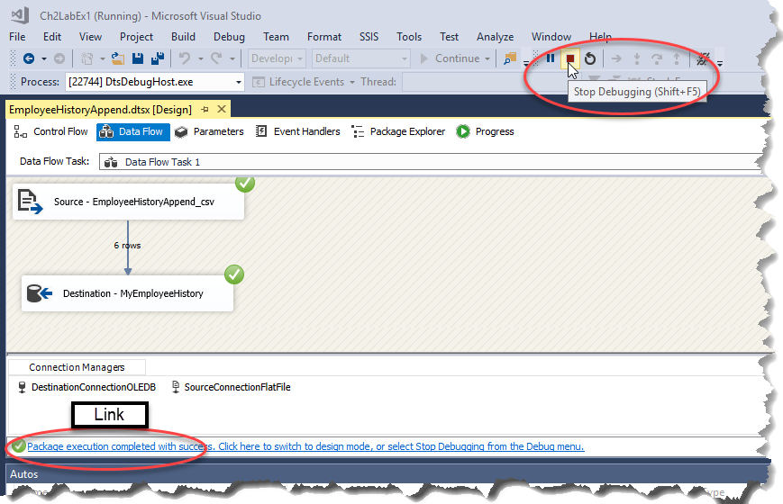

# Lesson 02 Lab Instructions

## Exercise 1: Answer Key

Please note, there are several ways to accomplish the same task in SSIS. The book uses a variety of methods to
 expose
 you to different options. Feel free to use your favorite method throughout the exercises.

The goal of this exercise is to practice adding an existing package to an Integration Services project in SQL
 Server
 Data Tools.

1. Create a new SSIS project named **Ch2LabEx1** stored in the **Studentfiles** folder. The project should be created in a new solution with the same name.
    1. Launch **SQL Server Data Tools for Visual Studio (SSDT)**.
    2. Select **File > New > Project**.
    3. In the New Project window, expand **Installed > Business Intelligence > Integration
     Services**. Select **Integration Services Project**. Browse to the **Studentfiles** folder, and change the Name to **Ch2LabEx1**. Verify that
     **Create directory for solution** is checked, and then click <code class="nocopy">OK</code>.
2. Delete the default **Package.dtsx** package.
    1. In Solution Explorer, right-click the **ImportMyEmployeeHistory.dtsx** package, and then click <code class="nocopy">Delete</code>.
    2. Click <code class="nocopy">OK</code> to confirm that you want to permanently delete **Package.dtsx**.
3. Add the package located at **Chapter 02
 SSDT\Labs\Starters\EmployeeHistoryAppend.dtsx** to the Ch2LabEx1 project.
    1. In the Solution Explorer, right-click <code class="nocopy">SSIS Packages</code> and select **Add Existing
     Package**.
    2. In the **Add Copy of Existing Package** window, verify that the Package location is set to
     **File
     System** in the drop-down list. Next to Package path, click the ellipsis (**…**) button,
     browse to **Chapter 02 SSDT\Labs\Starters\EmployeeHistoryAppend.dtsx**, and then
     click
     <code class="nocopy">Open</code>.
    3. Click <code class="nocopy">OK</code>.
4. Review the Control Flow and Data Flow tabs. Notice that the package is moving data from a csv file to the
 MyEmployeeHistory table.
    1. In Solution Explorer, in the SSIS Packages folder, double-click **EmployeeHistoryAppend.dtsx** to open it in the package
     designer tab.
    2. Review the Control Flow and Data Flow tabs. Notice that the package is moving data from a csv file to the
     existing MyEmployeeHistory table created in the Chapter 1 lab.

        If you did not perform the lab in Chapter 1 or if your MyEmployeeHistory table was deleted,
        import and run the **ImportMyEmployeeHistory.dtsx** file in the **Chapter 02 SSDT\Labs\Starters**
        folder before running the **EmployeeHistoryAppend.dtsx** package.

5. Run the package and verify that it ran successfully. End debug mode to return to design mode.
    1. Click <code class="nocopy">Start</code> () from
     the toolbar.
    2. Check for success  (green
     circles with check marks) on the Control Flow, Data Flow tabs and no errors on the
     Progress tab.
    3. End Debug mode by either clicking the link or the <code class="nocopy">Stop Debugging</code> button () as shown in Figure 18:
     
6. Click the <code class="nocopy">Save All</code> icon () to
 save, and then click File > Close Solution to close your project and solution to
 prepare for the lab. Leave SSDT open for the next chapter.
7. Use SQL Server Management Studio to verify that the new rows were added to the dbo.MyEmployeeHistory table in
 the
 Adventureworks database.
    1. Open SQL Server Management Studio.
    2. Enter your server and authentication information, and then click <code class="nocopy">Connect</code>.
    3. Select () from the toolbar.
    4. In the Query window, type the following query:
     
    ```
    USE AdventureWorks;
    SELECT * FROM dbo.MyEmployeeHistory;
    ```
    5. Click  from the toolbar. The status bar at
     the bottom of the window should indicate that the query now 296 rows, as
     opposed to only the original 290 rows transferred in Chapter 1.
8. Close SQL Server Management Studio without saving any changes.