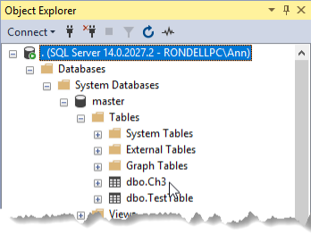

# Lesson 03 Lab Instructions

## Exercise 1 – Precedence Constraints and Execute SQL Task

1. Create a new project in a new solution. Both the project and the solution should be named
 **Ch3Lab**
 in the **\Studentfiles** folder. You should create a separate folder for the solution file. Save the
 files to the default location. Make note of the file system location of your new project.
2. Rename the default **Package.dtsx** file to
 **Ch3Precedence.dtsx**.
3. Add four Script tasks to the design surface.
4. Rename the Script tasks as follows:
    1. Required Step 1
    2. Required Step 2
    3. Email Success
    4. Email Failure
5. Add Precedence Constraints so that Required Step 2 only executes when Required Step 1 succeeds. Email Success
 should only run after Required Step 2 succeeds. Email Failure should run when either Required Step 1 or Required
 Step
 2.
6. Execute the entire package to verify the “on success” path.
7. Modify the Required Step 1 task to return a “fail” result even though it doesn’t fail. Execute the package to
 test
 the “failure” path.
8. Change the ForceExecutionResult property Required Step 1 back to None.
9. If time permits, test forcing Required Step 2 to fail and checking that failure path.
10. Create a new package and rename it to **3Building.dtsx**.
11. Add an Execute SQL Task to the **3Building.dtsx** design surface.
12. Rename Execute SQL Task to DROP and CREATE.
13. Open SQL Server Management Studio (SSMS) and connect to your class SQL Server instance with the appropriate
 credentials.
14. Open a new query window and type the following SQL Code. (If you are using SQL Server 2014 or earlier, you must
 replace the <code class="nocopy">IF EXISTS</code> clause from the DROP table with an <code class="nocopy">IF</code> statement that checks for
 the existence of the table
 before issuing the <code class="nocopy">DROP TABLE</code> command:
 
```
USE AdventureWorks;
DROP TABLE IF EXISTS Ch3;
GO
CREATE TABLE Ch3
(col1 int, col2 varchar(20), col3 varchar(250))
;
```
15. Execute the query to verify that it works.
16. Copy the code from SSMS into the clipboard memory, and then return to SSDT. Do not close SSMS.
17. Open the DROP and CREATE task editor and set the following properties:
    1. ConnectionType – OLE DB
    2. Connection – new OLE DB connection manager pointing to the AdventureWorks database on your local SQL Server
     instance.
    3. SQLSourceType – Direct Input
    4. SQLStatement – the statement you wrote in SSMS.
18. Execute the DROP and CREATE task to verify that it works.
19. Return to SSMS and browse the Object Explorer to verify that the <code class="nocopy">dbo.Ch3</code> table exists as shown in Figure 17. You
 may need to <code class="nocopy">Right-click > Refresh</code> the tables folder to see the new table:
 
20. Close SSMS.
21. Click the <code class="nocopy">Save All</code> button () to save, and then click <code class="nocopy">File > Close Solution</code> to close your
 **Ch3Lab** solution. Leave SSDT open for the next chapter.