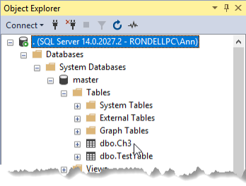

# Lesson 03 Lab Instructions

## Exercise 1: Answer Key

1. Create a new project in a new solution. Both the project and the solution should be named
 **Ch3Lab**
 in the **\Studentfiles** folder. You should create a separate folder for the solution file. Save the
 files to the default location. Make note of the file system location of your new project.
    1. Open SSDT.
    2. Select **File > New > Project**.
    3. In the New Project window, expand **Installed > Business Intelligence > Integration
     Services**. Select **Integration Services Project**. Change the Name to
     **Ch3Lab**. Browse to the **\Studentfiles** Verify that **Create directory for
     solution** is checked, and then click `OK`.
    4. In the Solution Explorer, click `Ch3Lab`. In the Properties window, hover over
     **FullPath** and write down the path to your solution folder.
2. Rename the default **Package.dtsx** file to
 **Ch3Precedence.dtsx**.
    1. In the Solution Explorer, expand **SSIS Packages** (if necessary), Right-click **Package.dtsx** and select **Rename**. Rename the package
     **Ch3Precedence.dtsx**.
3. Add four Script tasks to the design surface.
    1. Drag the Script Task element from the SSIS Toolbox to the design surface.
    2. Repeat this process until you have a total for four Script tasks on the design surface.
4. Rename the Script tasks as follows:
    1. Required Step 1
    2. Required Step 2
    3. Email Success
    4. Email Failure
        1. Click a task to activate it, and then right-click and select **Rename**.
        2. Type the name as indicated above.
        3. Repeat for the other three tasks.
5. Add Precedence Constraints so that Required Step 2 only executes when Required Step 1 succeeds. Email Success
 should only run after Required Step 2 succeeds. Email Failure should run when either Required Step 1 or Required
 Step 2.
    1. Drag a precedence constraint from Required Step 1 to Required Step 2. Leave it as a green “on success”
     constraint.
    2. Drag a precedence constraint from Required Step 2 to Email Success and leave it green “on success”
     constraint.
    3. Drag a precedence constraint from Required Step 1 to Email Failure and right-click the constraint line to
     set it to Failure.
    4. Drag a precedence constraint from Required Step 2 to Email Failure and right-click the constraint line to
     set it to Failure.
    5. Click to select one of the lines to Email Failure, right-click and select **Edit**.
    6. Change the Multiple constraints setting to **Logical OR. One constraint must evaluate to
     True**.
    7. Click `OK`. The completed package should appear as in Figure 16.
     
6. Execute the entire package to verify the “on success” path.
    1. Click the `Start` button to run the package. A green circle with a check mark () should appear at the
     corner of all the tasks except “Email failure”.
    2. Click the `Stop Debugging` button () to return to Design mode.
7. Modify the Required Step 1 task to return a “fail” result even though it doesn’t fail. Execute the package to
 test
 the “failure” path.
    1. In the Properties window of the Required Step 1 task (`F4` will display this window if you closed
     it), in the
     Misc section, set the ForceExecutionResult property to **Failure**.
    2. Click the `Start` button to run the package. Although the Required Step 1 task completes, you
     will
     see a red circle with an x () in the corner of
     this task. The Email Failure task should have a green circle with a
     check mark ().
    3. Click the `Stop Debugging` button () to return to Design mode.
8. Change the ForceExecutionResult property Required Step 1 back to None.
    1. In the Properties window of the Required Step 1 task, in the Misc section, set the ForceExecutionResult
     property to **None**.
9. If time permits, test forcing Required Step 2 to fail and checking that failure path.
    1. In the Properties window of the Required Step 2 task, in the Misc section, set the ForceExecutionResult
     property to **Failure**.
    2. Click the `Start` button to run the package. Although the Required Step 2 task completes, you
     will
     see a red circle with an x () in the corner of
     this task. The Email Failure task should have a green circle with a
     check mark .
    3. Click the `Stop Debugging` button () to return to Design mode.
    4. In the Properties window of the Required Step 1 task, in the Misc section, set the ForceExecutionResult
     property to **None**.
10. Create a new package and rename it to **3Building.dtsx**.
    1. In the Solution Explorer, Click `SSIS Packages`, right-click and select **New SSIS
     Package**.
    2. Click **Package.dtsx** and select **Rename**. Rename the package
     **3Building.dtsx**.
11. Add an Execute SQL Task to the **3Building.dtsx** design surface.
    1. Verify that the **3Building.dstx** design surface is active.
    2. Double-click the **Execute SQL Task**.
12. Rename Execute SQL Task to DROP and CREATE.
    1. Click the **Execute SQL Task** to select it, right-click and select **Rename**.
    2. Type **DROP and CREATE**.
13. Open SQL Server Management Studio (SSMS) and connect to your class SQL Server instance with the appropriate
 credentials.
    1. In the Connect to Server dialog box, verify the following options, and then click `Connect`.
     
    If you are not running the database engine on your local computer, enter the appropriate
     server name and authentication information for your environment.

|  |  |
| --- | --- |
| **Field** | **Value** |
| Server type | Database Engine |
| Server name | (local) |
| Authentication | Windows Authentication |
14. Open a new query window and type the following SQL Code. (If you are using SQL Server 2014 or earlier, you must
 replace the `IF EXISTS` clause from the DROP table with an `IF` statement that checks for
 the existence of the table
 before issuing the `DROP TABLE` command.
 
```
USE AdventureWorks;

DROP TABLE IF EXISTS Ch3; 
GO
CREATE TABLE Ch3
    (col1 int, col2 varchar(20), col3 varchar(250))
;

```

    1. Click the `New Query` button () or type `Ctrl+N` to open a new query window.
    2. Type the above code in the new query window. The code can be opened from **DROP TABLE
     Ch3.sql** in the
     **Chapter 03 Control Flow\Labs\Starters** folder if needed.
15. Execute the query to verify that it works.
    1. Press `F5` or click the `Execute` button () to run the query.
16. Copy the code from SSMS into the clipboard memory, and then return to SSDT. Do not close SSMS.
    1. Highlight the code and press `Ctrl+C`.
17. Open the DROP and CREATE task editor and set the following properties:
    1. ConnectionType – OLE DB
    2. Connection – new OLE DB connection manager pointing to the AdventureWorks database on your local SQL Server
     instance.
    3. SQLSourceType – Direct Input
    4. SQLStatement – the statement you wrote in SSMS.
        1. Right-click the DROP and CREATE task to open the Execute SQL Task Editor.
        2. Select OLE DB in the ConnectionType.
        3. Click <New connection …> in the Connection property.
        4. If a Data connection for the AdventureWorks database is showing from a previous exercise, you can pick
         it,
         and skip to Step (8). Otherwise, click `New` and follow the remaining directions.
        5. Verify that **Native OLE DB\SQL Native Client 11.0** is selected in the Provider drop-down
         list.
        6. Type a **period** (**.**) in the Server name box.
         
        If you are not running a local SQL Server, configure the Server name and
         Authentication as you were directed for the class.
        7. Select **AdventureWorks** from the drop-down list under Select or enter a database name,
         and
         then click `OK`.
        8. Click `OK` to close the Configure OLE DB Connection Manager dialog box.
        9. Click the ellipsis (`…`) in the SQLStatement box to open the dialog box.
        10. Paste the SQL code from your SSMS query in the Enter SQL Query dialog box.
        11. Click `OK` to close the Enter SQL Query dialog box.
        12. Click `OK` to close the Execute SQL Task Editor.
18. Execute the DROP and CREATE task to verify that it works.
19. Return to SSMS and browse the Object Explorer to verify that the dbo.Ch3 table exists as shown in Figure 17.
 You may need to Right-click > Refresh the tables folder to see the new table:
 
20. Close SSMS.
21. Click the `Save All` button () to save, and then click `File > Close Solution` to close your
 **Ch3Lab** Leave SSDT open for the next chapter.