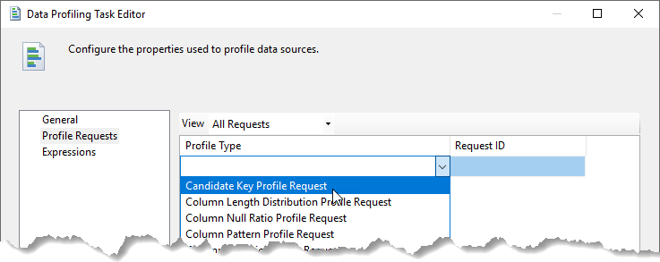
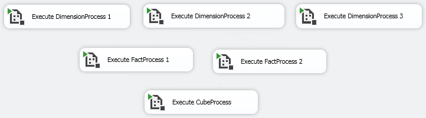
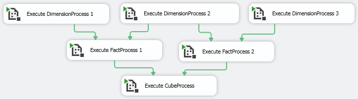
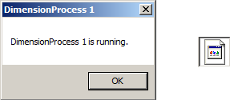

# Lesson 04 Lab Instructions

## Exercise 1: Answer Key

The goal of this exercise is to create a new project and then modify the default package to copy the
 **ProductsBlue.csv** file from the **Starters** folder to the
 **\Studentfiles\Ch4LabEx1** folder. You will also configure a Send Mail Task to send an
 email notification if the file copy fails.
 

1. Create a new project in a new solution. Both the project and the solution should be named
 **Ch4LabEx1**. You should create a separate folder for the solution file. Save the files to the
 **\Studentfiles** Make note of the full path to your new project. Set your project
 TargetServerVersion to
 SQL Server 2016.
    1. Start **SQL Server Data Tools for Visual Studio**.
    2. Select <code class="nocopy">File > New > Project</code>.
    3. In the New Project window, expand <code class="nocopy">Business Intelligence > Integration Services</code>. Select
     <code class="nocopy">Integration Services Project</code>. Change the Name to **Ch4LabEx1**. Verify that
     <code class="nocopy">Create directory for solution</code> is checked, and then click <code class="nocopy">OK</code>.
    4. In the Solution Explorer, click <code class="nocopy">Ch4LabEx1</code>. In the Properties window, hover over
     **FullPath** and write down the path to your solution folder. You will be moving a file to this
     location later.
    5. Right-click the Ch4LabEx1 project, and then click <code class="nocopy">Properties</code>.
    6. On the Configuration Properties page, change the TargetServerVersion to **SQL Server 2016**,
     and
     then click <code class="nocopy">OK</code>.
    7. Click <code class="nocopy">Yes</code> to accept the change, and then click <code class="nocopy">Yes to All</code> if prompted to reload
     the
     files.
2. Rename the default **Package.dtsx** file to **CopyFile.dtsx**.
    1. In the Solution Explorer, expand <code class="nocopy">SSIS Packages</code> (if necessary), Right-click **Package.dtsx** and
     select <code class="nocopy">Rename</code>. Rename the package **CopyFile.dtsx**.
3. Add a <code class="nocopy">File System Task</code> item to the Control Flow and name it **Copy File**.
    1. Drag a File System Task from the SSIS Toolbox to the Control Flow.
    2. Open the File System Task Editor by double-clicking the File System Task.
    3. In the General section of the General page, change the Name to **Copy File**.
4. Set the following properties for the Copy File task.
    1. Set the **Operation** to **Copy file**.
        1. In the Operation section, select **Copy file** from the Operation dropdown list.
    2. Set the **SourceConnection** to a new connection manager that points to the existing file **Chapter 04 Common Tasks\Labs\Starters\ ProductsBlue.csv**.
        1. In the Source Connection section, select <code class="nocopy"><New Connection…></code> from the
         SourceConnection dropdown list.
        2. In the File Connection Manager Editor, select <code class="nocopy">Existing File</code> from the Usage type dropdown
         list. Click the <code class="nocopy">Browse</code> button and navigate to **\Chapter 04 Common
         Tasks\Labs\Starters\ProductsBlue.csv,** and then click <code class="nocopy">Open</code>.
        3. Click <code class="nocopy">OK</code> to close the File Connection Manager Editor.
    3. Set the <code class="nocopy">DestinationConnection</code> to a new connection manager that points to the existing folder
     that you wrote down in step 1 above.
        1. In the Destination Connection section of the General page in the File System Task Editor, set
         <code class="nocopy">DestinationConnection</code> to <code class="nocopy"><New Connection…>.</code>
        2. In the File Connection Manager Editor, select <code class="nocopy">Existing folder</code> from the Usage type
         drop-down list, and **Browse** to the folder that you wrote down in step 1 above, and then
         click
         <code class="nocopy">OK</code>.
    4. Configure the destination so that a file can be copied multiple times and simply overwrite the existing file
     each time.
        1. In the Destination Connection section of the General page in the File System Task Editor, set
         OverwriteDestination to **True**.
        2. Click <code class="nocopy">OK</code> to close the File System Task Editor.
5. Execute just this new task to test it. Once the task has completed successfully, leave debug mode. If the
 task failed, double check your settings and execute the task again.
    1. Right-click the <code class="nocopy">Copy File</code> task and select <code class="nocopy">Execute Task</code> to test that the
     file is moved to the proper location. A green circle with a check mark () should appear at the corner of
     the Copy
     File task.
    2. Click the <code class="nocopy">Stop Debugging</code> button () to return to Design mode.
6. Add a <code class="nocopy">Send Mail Task</code> that will run only when the copy task fails. Configure the SMTP
 connection manager to point to localhost. Add a subject line and message source telling the recipient that the
 copy file task failed. *If you are using a corporate email server, the To and From addresses should both be your email address.*
 
    1. Drag a Send Mail Task onto the Control flow and connect the Copy File task to it. Right-click the
     connection and select <code class="nocopy">Failure</code> as the type of connection.
    2. Double-click the <code class="nocopy">Send Mail Task</code> to open the Send Mail Task Editor. On the Mail page,
     set the SmtpConnection to **<New Connection…>.**
    3. In the SMTP Connection Manager Editor, set the SMTP server to **localhost**, and then click
     <code class="nocopy">OK</code>.
    4. On the mail page, set the following properties:
        1. From: tech@adventure-works.com
        2. To: admin@adventure-works.com
        3. Subject: Problem with file copy
        4. MessageSource: There has been a problem with the file copy operation.
    5. Click <code class="nocopy">OK</code> to close the Send Mail Task Editor.
7. Execute the entire package. The Send Mail Task should not execute. Set the Copy File task to report a failure
 even when it succeeds, and then test the entire package again to verify that the package ran and the send mail
 task ran successfully.
    1. Click the <code class="nocopy">Start</code> button to run the package. A green check mark should appear at the corner of
     the first
     task.
    2. Click the <code class="nocopy">Stop Debugging</code> button () to return to Design mode.
    3. Select the Copy File task on the design surface or in the drop-down in the Properties window.
    4. In the Properties window of the Copy File task (F4 will display this window if you closed it), in the Misc
     section, set the ForceExecutionResult property to Failure.
    5. Click the <code class="nocopy">Start</code> button to run the package. Although the Copy File task completes successfully,
     you will
     see a red circle with an x () in the corner of
     this task.
     The Send Mail Task should have a green circle with a check mark ().
    6. Click the <code class="nocopy">Stop Debugging</code> button () to return to Design mode.
    7. Open Windows Explorer (My Computer), and verify that your email message has been added to
     **C:\inetpub\mailroot\Drop**. If you are using a full email system, verify that the
     email was received rather than
     checking the folder location.

## Exercise 2: Answer Key

The goal of this exercise is to utilize the Data Profiling Task to explore the data contained in various tables
 from
 the AdventureWorksDW database. You will set up four profile requests. The first will allow you to determine if the
 ProductAlternateKey field contains unique values, and if not, what duplications exist. The second and third will
 allow
 you to look at the distribution of country codes in both the DimGeography and the FactResellerSales table to see if
 the
 actual sales are distributed in a similar way to the reseller locations. The fourth profile request will show you
 general statistics on the SalesAmount column for each line item.

1. Use SQL Server Management Studio to run the **Ch4\_CreateView.sql** script in the **Chapter 04 Common Tasks\Labs\Starters\** folder. This will create a view that includes
 both reseller sales data and country codes.
    1. Launch SQL Server Management Studio from the Start menu . In the Connect to Server dialog box, verify that:
        1. Server type is set to **Database Engine**,
        2. Server name is set to **(local)**,
        3. Authentication is set to **Windows Authentication**.
         
        If your configuration varies from the default classroom configuration, enter the appropriate
         server name and credentials.
    2. Click <code class="nocopy">Connect</code>.
    3. Click <code class="nocopy">Open File</code> on the toolbar (alternatively, select **File > Open > File**  from the menu.)
    4. Browse to the **Chapter 04 Common Tasks\Labs\Starters\Ch4\_CreateView.sql**, and
     then click <code class="nocopy">Open</code>.
    5. Click <code class="nocopy">Execute</code> on the toolbar. The status bar should report Query executed successfully.
    6. Close SQL Server Management Studio.
2. Return to SSDT and the **Ch4LabEx1** project that you created in Exercise 1.
3. Add an ADO.NET project connection manager to the AdventureWorksDW database.
    1. In Solution Explorer, right-click the Connection Managers folder, and then click <code class="nocopy">New Connection Manager</code>.
    2. In the Add SSIS Connection Manager dialog box, select <code class="nocopy">ADO.NET</code>, and then click
     <code class="nocopy">Add</code>.
    3. In the Configure ADO.NET Connection Manager dialog box, click <code class="nocopy">New</code>.
    4. In the Connection Manager dialog box:
        1. Set the Server name to . (period)
        2. Verify that **Use Windows Authentication** is selected.
        3. In the Select or enter database name dropdown list, select **AdventureWorksDW**, and then
         click <code class="nocopy">OK</code>.
    5. Click <code class="nocopy">OK</code> to close the Configure ADO.NET Connection Manager dialog box.
4. Create a new package named **Data Profiling** in the **Ch4LabEx1** project that you
 created in Exercise 1. If you did not complete exercise 1, you can use the solution located at **Chapter 04 Common Tasks\Labs\Answers\Ch4LabEx1**.
    1. In the Solution Explorer, right-click <code class="nocopy">SSIS Packages</code> and select **New SSIS
     Package**.
    2. Rename the package to **Data Profiling** by right-clicking the new package and selecting
     **Rename**.
5. Add a **Data Profiling Task** to the control flow that uses a new file connection as the
 destination. If the task is run multiple times, the existing data should be overwritten. Configure four profile
 requests as described in the following steps.
    1. If necessary, open the package designer.
    2. Drag a <code class="nocopy">Data Profiling Task</code> from the Common area of the SSIS Toolbox to the design
     surface.
    3. Right-click the task and choose <code class="nocopy">Edit</code>.
    4. In the Data Profiling Task Editor on the General tab, verify that DestinationType is set
     **FileConnection**
    5. Set the Overwrite Destination is set to **True**
    6. In the Destination box, click <<code class="nocopy">New File connection…></code>.
    7. In the File Connection Manager Editor, set Usage type to **Create file**. Click
     <code class="nocopy">Browse</code> and navigate to the folder that contains your solution. Enter a File name of
     **DataProfile.xml**, and then click <code class="nocopy">Open</code>. Click <code class="nocopy">OK</code> to
     dismiss the File Connection
     Manager Editor.
    8. Do not close the Data Profiling Task Editor.
6. Configure a **Candidate Key Profile Request** with the following settings:
    1. ConnectionManager – the **AdventureWorksDW** connection manager created in Step 2.
    2. TableOrView – **DimProduct**
    3. KeyColumns – **ProductAlternateKey**
    4. ThreshholdSetting – **None**
    
    If the threshold setting is set to Specified or Exact, data will only be returned to the report if the
     threshold
     is met or exceeded, depending on the setting. None will return all values and allow you to browse an
     unfamiliar data
     source.
    
    
    
     1. In the Data Profiling Task Editor, switch to the Profile Request tab.
     2. Select <code class="nocopy">Candidate Key Profile Request</code> from the Profile Type drop-down list as shown in
      Figure 18:
      
     3. Configure the Request Properties as specified in steps a-d above.
     4. Do not close the Data Profiling Task Editor.
If you want to delete a Profile Request, click it and hit the Delete key.
7. Configure a Column Value Distribution Profile Request with the following settings:
    1. ConnectionManager – the AdventureWorksDW connection manager created in Step 2.
    2. TableOrView – dbo.DimGeography
    3. Column – CountryRegionCode
    4. ValueDistributionOption – AllValues
        1. Select <code class="nocopy">Column Value Distribution Profile Request</code> from the Profile Type drop-down
         list.
        2. Configure the Request Properties as specified in steps a-d above.
        3. Do not close the Data Profiling Task Editor.
8. Configure a Column Value Distribution Profile Request with the following settings:
    1. ConnectionManager – the AdventureWorksDW connection manager created in Step 2.
    2. TableOrView – dbo.vResellerSalesWithCountry
    3. Column – CountryRegionCode
    4. ValueDistributionOption – AllValues
        1. Select <code class="nocopy">Column Value Distribution Profile Request</code> from the Profile Type drop-down
         list.
        2. Configure the Request Properties as specified in steps a-d above.
        3. Do not close the Data Profiling Task Editor.
9. Configure a Column Statistics Profile Request with the following settings:
    1. ConnectionManager – the AdventureWorksDW connection manager created in Step 2.
    2. TableOrView – dbo.FactResellerSales
    3. Column – SalesAmount
        1. Select <code class="nocopy">Column Statistics Profile Request</code> from the Profile Type drop-down
         list.
        2. Configure the Request Properties as specified above.
        3. Click <code class="nocopy">OK</code> to close the Data Profiling Task Editor.
10. Execute the DataProfiling project. Use the Profile Viewer in the Data Profiling Task Editor to review
 the information collected.
    1. Click <code class="nocopy">Start</code> () to
     run the task.
     Upon completion, the task should have a green check mark ().
    2. Click the <code class="nocopy">Stop Debugging</code> button () to return to Design mode.
    3. Right-click the Data Profiling task and choose <code class="nocopy">Edit</code>.
    4. In the Data Profiling Task Editor, click <code class="nocopy">Open Profile Viewer</code>. Explore the information
     returned. When you are finished, close the Data Profile Viewer and the Data Profiling Task Editor

If the Data Profile Viewer does not show anything in the Value Distribution area for one of the profile requests,
 click the Column name in the top section to display the value distributions.

## Exercise 3: Answer Key

The goal of this exercise is to configure a master package to emulate an ETL processing scenario. You will work
 with
 a project that includes all of the packages that you will need. You will then configure the master package to
 execute
 each of the three-dimension processing packages in parallel. Once the appropriate dimension tasks have successfully
 completed, the fact processing package should run. When both fact processing tasks have successfully completed, the
 cube
 processing package will run. Rather than actually processing data, for this simulation, a pop-up message box will
 appear
 telling you which package is running. Once you click <code class="nocopy">OK</code>, that package will complete successfully. This
 will allow you to
 test the control flow.

1. Use SQL Server Data Tools to open the **Chapter 04 Common
 Tasks\Labs\Starter\MasterPackage\MasterPackage.sln** solution file.
    1. In SSDT, click <code class="nocopy">File > Open > Project/Solution</code>
    2. Browse to **Chapter 04 Common
     Tasks\Labs\Starter\MasterPackage\MasterPackage.sln**, and then click <code class="nocopy">Open</code>.
2. Add six Execute Package Tasks to the Control Flow of the **MasterPackage.dtsx**
 package.
    1. In Solution Explorer, right-click the **MasterPackage.dtsx** package, and then
     click <code class="nocopy">Open</code>.
    2. Drag six <code class="nocopy">Execute Package Task</code> items from the Common section of the SSIS Toolbox to the
     Control Flow design surface.
3. Name, arrange, and edits the tasks and precedence constraints to meet the following goals.
    1. Tasks should be named to reflect the package that they are executing.
        1. Right-click each <code class="nocopy">Execute Package</code> task, and then click <code class="nocopy">Rename</code>.
        2. Rename three of the tasks, **Execute DimensionProcess *X***, where *X*
         represents the numbers 1, 2, and 3, following the package naming convention. Name two of the tasks to
         **Execute FactProcess X**, where *X* represents the numbers 1, and 2, following the
         package naming convention. The final task should be named **Execute CubeProcess**.
        3. For each task, right-click the task, and then click <code class="nocopy">Edit</code>. In the Execute Package Task
         Editor
         dialog box, change to the **Package** page, select the appropriate package name from the
         PackageNameFromProjectReference drop-down list, and then click <code class="nocopy">OK</code>
        
    2. The three dimension processing projects should be executed first, and in parallel.
        1. Arrange the three tasks with the word Dimension across the top of the design surface. Do not add any
         precedence constraints at this time.
    3. The **Execute FactProcess 1** task should only run after both the **Execute
     DimensionProcess 1** and the **Execute DimensionProcess 2** tasks have successfully
     completed.
        1. Draw green (Success) precedence constraints from both the **Execute DimensionProcess 1**
         and
         the **Execute DimsionProcess 2** tasks to the **Execute FactProcess 1**  The
         solid
         green lines represent a Boolean AND, meaning both of the dimension processing tasks must complete before
         the
         **Execute FactProcess 1** task can start running.
    4. The **Execute FactProcess 2** task should only run after both the **Execute
     DimensionProcess 2** and the **Execute DimensionProcess 3** tasks have successfully
     completed.
        1. **Execute Dimension Process 2** task should be connected to both the **Execute
         FactProcess 1** and the **Execute FactProcess 2** tasks with Success constraints.
        2. **Execute DimensionProcess 3** should be connect to the **Execute FactProcess 2**  tasks with Success constraints.
    5. The **Execute CubeProcess** task should only run after both fact processing tasks have
     completed
     successfully.
        1. Drag the green (Success) precedence constraint from both the **Execute FactProcess 1** and
         the **Execute FactProcess 2** tasks to the **Execute CubeProcess**. The
         completed
         Control Flow for the **MasterPackage.dtsx** appears in Figure 19.
4. Execute **MasterPackage.dtsx** in Debug mode. Notice that each of the packages opens
 when it starts running.
 Review the pop-up dialog boxes from the individual packages. Click <code class="nocopy">OK</code> on one message at a time, and
 review how this affects the task completions on the Control Flow tab of the **MasterPackage.dtsx**
 designer. When completed, exit Debug mode.
    1. Each of the tasks will open a pop-up dialog box similar to the shown here. Sometimes, they open behind the
     current windows and you need to select them from the taskbar using the icon shown on the right side of the
     figure:
     
5. Execute the package again, and click <code class="nocopy">OK</code> on the task messages in a different order and review how
 the process
 changed. When completed, exit Debug mode.
6. Configure the **Execute FactProcess 1** task to report a failure even when it succeeds. Run the
 **MasterPackage.dtsx** package again and review the tasks as the package runs. click
 <code class="nocopy">OK</code> on the
 messages that appear.
 When completed, review the final state of the tasks in the **MasterPackage.dtsx**
 package, and then exit
 Debug mode.
    1. Click **Execute FactProcess 1** to bring it into focus, and go the the Properties window.
    2. Set the **ForceExecutionResult** property in the Misc section to **Failure**.
    3. Execute **MasterPackage.dtsx**.
    4. Return to the **MasterPackage.dtsx** designer and review the results of the
     execution.
    5. Leave Debug mode.
7. Click <code class="nocopy">Save all</code> (), and then
 close the project and solution.

The message boxes are used in this example to make the packages pause so that you can see the flow of when the
 individual packages are executed. In the real world, you will not use message boxes in production packages since
 no
 one will be there to click <code class="nocopy">OK</code> on your automated packages.