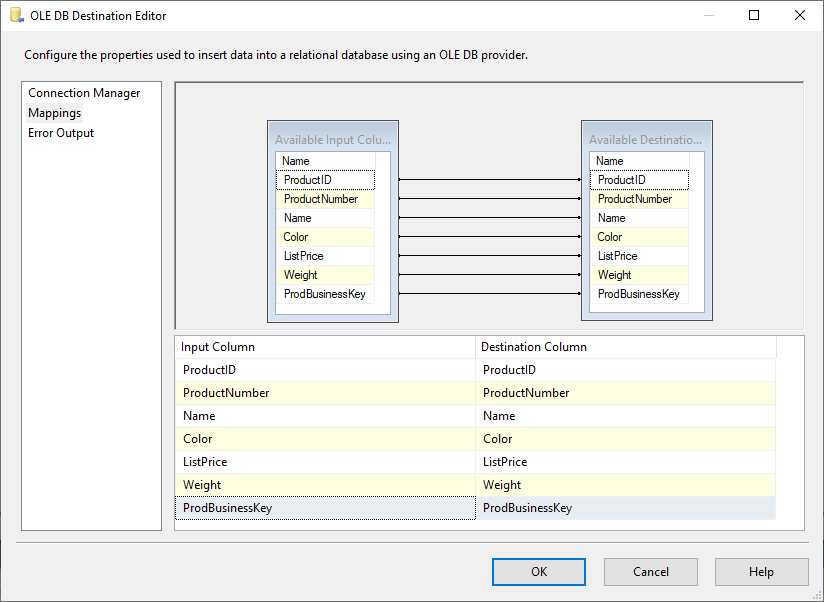

# Lesson 06 Lab Instructions

## Exercise 1: Answer Key

Please note, there are several ways to accomplish the same task in SSIS. The book uses a variety of methods to
 expose
 you to different options. Feel free to use your favorite method throughout the exercises.

The goal of this exercise is to reinforce your ability to work with the derived column transformation to add a new
 column to the data flow pipeline. This new column will be derived by concatenating two of the existing columns.

1. Open the Ch05LabEx1 project (you can use the solution you created in chapter 5 or the **Ch05LabEx1.sln** file located
 in the **Chapter 06 Transform\Labs\Starters** folder. If necessary, open the
 **DataSourcesandDestinations.dtsx** package.
    1. Open **SQL Server Data Tools**.
    2. Select `File > Open > File`. Navigate to the
     **Chapter 06 Transform\Labs\Starters\Ch05LabEx1.sln** file, and then click
     <code class="nocopy">Open</code>.
    3. In Solution Explorer under SSIS Packages, right-click **DataSourcesandDestinations.dtsx** and then
     click <code class="nocopy">Open</code>.
2. Modify the DF\_ProductsFFtoOLEDB data flow task to include a Derived Column transformation. The transformation
 should add a new column that concatenates the ProductNumber before the Name. Name the new column
 **ProdBusinessKey**. Use the Advanced Editor to change the ProdBusinessKey derived column to a string
 data type.
    1. In the Control Flow tab, click the **DFProductsFFtoOLEDB** Task, and then switch to the Data
     Flow
     tab.
    2. Click the blue data flow path arrow that connects the **FF\_ProductsRed\_Source** task with the
     **OLE\_ProductsRed\_Destination** task and press delete. Move the
     **OLE\_ProductsRed\_Destination** task down to create space for a new task.
    3. Drag a **Derived Column** task from the Common area of the SSIS Toolbox to the design surface
     between the two existing components.
    4. Click the **FF\_ProductsRed\_Source** task and drag the blue data flow path arrow to the
     **Derived Column** task. Similarly, click the **Derived Column** task and drag the
     blue arrow
     to the **OLE\_ProductsRed\_Destination** task.
    5. Double-click the **Derived Column** task.
    6. In the Derived Column Transformation Editor, type **ProdBusinessKey** in the Derived Column
     Name
     textbox.
    7. Expand Columns in the upper left box and drag **ProductNumber** to the Expression box. Type
     **+**" "**+** following the **[ProductNumber]** and then drag
     **Name** to the expression box. The completed expression should appear as follows:
     
    ```
    [ProductNumber]+" "+[Name]
    ```
    8. Click <code class="nocopy">OK</code> to close the Derived Column Transformation Editor.
    9. Right-click the **Derived Column** transformation, and then click `Show Advanced
     Editor`.
    10. Change to the Input and Output Properties tab.
    11. In the Inputs and outputs area, expand Derived Column Output, expand Output Columns, and then select
     ProdBusinessKey.
    12. In the Data Type Properties section on the right, change the DataType property to **string
     [DT\_STR]**.
    13. Click <code class="nocopy">OK</code> to close the Advanced Editor for Derived Column dialog box.
3. Use the **ModifyCh5Products.sql** file located in the **Chapter
 06
 Transform\Labs\Starters** folder to add a new column to the destination table. Modify the destination and
 map the
 new derived column from the data flow pipeline to the new column in your destination table.
    1. Open SQL Server Management Studio (SSMS). In the Connect to Server dialog box, verify that:
        * Server type is set to **Database Engine**,
        * Server name is set to **(local)**,
        * Authentication is set to **Windows Authentication**.
         **Note:** If your configuration varies from the default classroom configuration, enter the
         appropriate
         server name and credentials.
    2. Click <code class="nocopy">Connect</code>.
    3. Click **File > Open > File**. Navigate to the **Chapter 06
     Transform\Labs\Starters\ModifyCh5Products.sql** file, and then click <code class="nocopy">Open</code>.
    4. Click <code class="nocopy">Execute</code>. “ Query executed successfully” should be displayed on the status bar at the
     bottom of
     the window.
    5. Leave SQL Server Management Studio open.
    6. Switch back to SSDT.
    7. Connect the new derived column to the destination.
    8. Right-click the **OLE DB Destination** component, and then click <code class="nocopy">Edit</code>.
    9. Change to the **Mappings** page.
    10. Verify that all input columns are mapped as shown in Figure 22:
     
    11. Click <code class="nocopy">OK</code> to close the OLE DB Destination Editor.
4. Test just this dataflow and verify that the new column is populated in the Ch5Products table.
    1. In SSDT, right-click inside the Data Flow tab and click <code class="nocopy">Execute Task</code>. The three items should
     execute
     successfully. Click Stop Debugging.
    2. Return to SQL Server Management Studio and open a **New Query**. Type the following query, and
     then
     click <code class="nocopy">Execute</code>:
     
    ```
    Use AdventureWorks;
      Select * from dbo.Ch5Products;
    ```
    3. Verify that the **ProdBusinessKey** column contains the both the Product Number and Name.

## Exercise 2: Answer Key

The goal of this exercise is to review the process of using a lookup transformation to retrieve data from a
 different
 source to use in the data pipeline.

1. Change the DF\_SalesOrdersExceltoRecordset data flow task to use a Conditional Split transformation to produce
 two
 outputs. Records with a SalesPersonID should go to an output named ResellerSales. The default output should be
 renamed
 to InternetSales.
    1. In the Control Flow tab, click the **DF\_SalesOrdersExceltoRecordset** task, and
     then switch to the Data Flow tab.
    2. Click the blue data flow path arrow that connects the **XL\_SalesOrders\_Source** component with
     the **RS\_SalesOrders\_Destination** component and press delete. Move the
     **RS\_SalesOrders\_Destination** component down to create space for a new component.
    3. Drag a **Conditional Split** component from the Common area of the SSIS Toolbox to the design
     surface between the two existing components.
    4. Click the **XL\_SalesOrders\_Source** component and drag the blue data flow path arrow to the
     **Conditional Split** component.
    5. Double-click the **Conditional Split** component.
    6. In the Conditional Split Transformation Editor, type **ResellerSales** in the Output Name
     textbox.
    7. In the Condition textbox, type the following expression:
     
    ```
    !ISNULL(SalesPersonID)
    ```
    8. Change the Default output name to **InternetSales**.
    9. Click <code class="nocopy">OK</code> to dismiss the Derived Column Transformation Editor.
2. The InternetSales output should go directly to the RecordSet destination. Rename this destination
 appropriately.
    1. Click the Conditional Split component and drag the blue data flow path arrow to the
     **RS\_SalesOrder\_Destination**.
    2. In the Input Output Selection dialog box that appears, select **InternetSales** from the Output
     drop-down list, and then click <code class="nocopy">OK</code>.
    3. Right-click the **RS\_SalesOrder\_Destination** component and select **Rename**.
     Rename
     the component **InternetSales\_Destination**.
3. Use a Data viewer to verify that the records do not include a SalesPersonID.
    1. Right-click the blue data flow path arrow labeled **InternetSales** and select **Enable
     Data
     Viewer**.
    2. Right-click the design surface and select **Execute Task**. In the Data viewer that appears,
     verify
     that the SalesPersonID field only contains NULL values.
4. Use the Advanced Editor to modify the XL\_SalesOrder\_Source so that SalesPersonID output column has a Data Type
 of
 **four-byte signed integer**.
    1. Right-click the **XL\_SalesOrder\_Source** component and select **Show Advanced
     Editor**.
    2. On the Input and Output Properties tab, expand **Excel Source Output**.
    3. Expand **Output Columns**.
    4. Click SalesPersonID.
    5. Change the Data Type property to **four-byte signed integer [DT\_I4]**.
    6. Click <code class="nocopy">OK</code>.
5. Use a Lookup transformation to Add the SalesPerson’s name as a single column to the ResellerSales output.
 You have to use the Person.Person table in the AdventureWorks database to locate the sales person’s name. The
 lookup
 should be performed by matching the <code class="nocopy">SalesPersonID</code> and the <code class="nocopy">BusinessEntityID</code>. The
 transformation should be set up so as
 not to fail even if a sales person’s name cannot be found.

    1. Drag a **Lookup** component from the Common area of the SSIS Toolbox to the design surface.
    2. Click the Conditional Split component and drag the blue data flow path arrow to the **Lookup**  component. The arrow should automatically label itself **ResellerSales**.
    3. Double-click the **Lookup** component. In the Lookup Transformation Editor on the General tab
     configure the items as follows:
        * Cache mode: **Full cache**
        * Connection type: **OLE DB connection manager**
        * Specify how to handle rows…: **Redirect rows to no match output**
     On the connection tab:
        * OLE DB manager: **LocalHost.AdventureWorks**
        * Select **Use results of a SQL query**
        * Type the query as shown below:
         
        ```
        
        SELECT BusinessEntityID, FirstName + ' ' + LastName
        AS FullName
        FROM Person.Person
        ```
     On the Columns tab:
        * Drag **SalesPersonID** from the Available Input Columns and drop it on
         **BusinessEntityID** in the Available Lookup Columns. A line connecting the two columns
         appears.
        * Check the box next to the **FullName** column in the Available Lookup Columns to include it
         in the
         output.
        * Click <code class="nocopy">OK</code>.
6. Send the full Reseller Sales Output to a new flat file named **ResellerSalesOrders2011.csv**.
 Configure the output to append to the end of the file each time the component is run.
    1. Drag a **Flat File Destination** from the Other Destinations area of the SSIS Toolbox to the
     design
     surface.
    2. Click the **Lookup** component and drag the blue data flow path arrow to the **Flat File
     Destination**.
    3. In the Input Output Selection dialog box, set Output to **Lookup Match Output** using the
     drop-down
     list, and then click <code class="nocopy">OK</code>.
    4. Double-click the **Flat File Destination**. In the Flat File Destination Editor, uncheck
     **Overwrite data in the file**, and then click <code class="nocopy">New</code>. Verify that Delimited is
     selected in the
     Flat File Format dialog box, and then click <code class="nocopy">OK</code>.
    5. In the Flat File Connection Manager Editor, name the connection manager **FF\_ResellerSales**.
     Click
     <code class="nocopy">Browse</code>. Navigate to your **Studentfiles** folder and type
     **ResellerSalesOrders2011** for the file name. Use the drop-down list next to the File name box
     to change
     the file type to **CSV files (\*.csv)**, and then click <code class="nocopy">Open</code>.
    6. In the Flat File Connection Manager Editor, type one double-quote (“) in the Text qualifier textbox.
    7. Check **Column names in the first data** row, and then click <code class="nocopy">OK</code> to dismiss the
     Flat
     File Connection Manager Editor.
    8. In the Flat File Destination Editor, click <code class="nocopy">Mappings</code>, and then click <code class="nocopy">OK</code>.
7. Test this dataflow and verify that the csv file has the correct information.
    1. Right-click the design surface and select **Execute Task**. After the task completes
     successfully,
     click Stop Debugging.
    2. Using Windows Explorer, navigate to your **Studentfiles** folder and open
     **ResellerSalesOrders2011.csv** in Excel. Verify that the last column contains the
     sales person’s full
     name.
    3. Close Excel and return to SSDT.