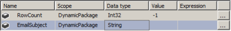

# Lesson 07 Lab Instructions

## Exercise 1: Making a Package Dynamic

In this exercise, you will practice working with project parameters, package variables, query parameters, and
 expressions and see how all of these pieces fit together into a single solution. The starter project files include a
 basic package that includes a single data flow task. The current data flow task retrieves information on employees
 that
 have been assigned to the Sales department. You will modify the data source query so that any department name can be
 passed to the project. Additionally, you will use this department name to change the name of the flat file to be
 written. Finally, you will add a send mail task where the To and the Subject properties will be set dynamically,
 based
 on the department chosen.

1. Use SSDT to open the **Chapter 07 Dynamic\Labs\Starters\Lab7\_Starter\Lab7.sln**
 solution file. Open the
 **DynamicPackage.dtsx** package.
2. Add a project parameter named **ProjEmailToAddress**. Set the data type to string and the default
 value to **ProjectAdmin@adventure-works.com**.
3. Add the following variables to the package. Configure each variable at the package scope as defined in the
 following table: 
**Note:** You will configure an expression for the EmailSubject variable later in this exercise.
4. Add a project parameter named **Department**, with a data type of **String** and a
 default value of **Finance**. Map this parameter to the **Adventureworks
 Employee Source** data source to pass the department name to the WHERE clause in the query.
 Test your new parameter by changing the project parameter to **Sales**, **Production**,
 or **Finance**, and then view the results in the **Chapter 05\ Answers\EmployeeHistory.csv**  file.
5. Add a Row Count transformation and pass the acquired row count to your **RowCount** variable.
6. In the variables window, set an expression for the EmailSubject variable. Concatenate the row count and the
 department name to create an email subject line reporting how many rows were added and from what department.
7. Create a project parameter named **DestinationPath** to point to the path hard coded in the
 **FF\_EmployeeHistory** connection manager.

    This feature can be used to change the
    drive letter dynamically when the package moves from the development to test and then production servers. You
    will practice configuring environments in a later chapter.
8. Add a package variable named **VarDestinationPath** to hold the full path, including a dynamic file
 name based on the **DestinationPath** and **Department** project parameters.
9. Configure **VarDestinationPath** variable to use an expression to name the csv file based on the
 department set in the Department variable. For example, when the Department variable is set to Finance, the
 expression should evaluate to: **C:\Classfiles\SSIS2016\Chapter 07 Dynamic\Labs\Answers\
 FinanceEmployeeHistory.csv**
10. Set the FF\_EmployeeHistory connection manager to point to the VarDestinationPath variable.
11. Add a Send Mail Task to the package and set up the constraints so that it runs after the Data Flow Task
 succeeds.
12. Edit the Send Mail Task. Create the appropriate connection manager to your mail server, and then set the From
 field to **SSISPackage@adventure-works.com**.
13. Use expressions to dynamically set the To and the Subject lines.
    1. Set the **ToLine** property to **@[$Project::ProjEmailToAddress]**.
    2. Set the **Subject** property to **@[User::EmailSubject]**.
14. Change the DelayValidation property to True.
 
    When executing a package, the server validates all properties required for successful execution. In the Send Mail
    task, if all of your email address expressions evaluate to properly formed addresses, the DelayValidation property
    does not need to be set to True in SSIS 2014 and later. However, since a validation error will stop the package from
    running, delaying validation is typically still a best practice. Prior versions of SSIS required this field to be set
    to True when expressions were used in any required fields.
15. Start debugging the package and test the results of the file location and name along with the email subject
 heading and to address. If necessary, troubleshoot any errors.
 
    If you are using the built-in SMTP with Windows
    Server, you can find your email at: **C:\inetpub\mailroot\Drop**
16. If time permits, change some of the parameters and variables and test the package again.