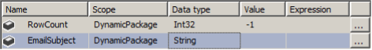

# Lesson 07 Lab Instructions

## Exercise 1: Answer Key

Please note, there are several ways to accomplish the same task in SSIS. The book uses a variety of methods to
 expose
 you to different options. Feel free to use your favorite method throughout the exercises.

In this exercise, you will practice working with project parameters, package variables, query parameters, and
 expressions and see how all of these pieces fit together into a single solution. The starter project files include a
 basic package that includes a single data flow task. The current data flow task retrieves information on employees
 that
 have been assigned to the Sales department. You will modify the data source query so that any department name can be
 passed to the project. Additionally, you will use this department name to change the name of the flat file to be
 written. Finally, you will add a send mail task where the To and the Subject properties will be set dynamically,
 based
 on the department chosen.

1. Use SSDT to open the **Chapter 07 Dynamic\Labs\Starters\Lab7\_Starter\Lab7.sln**
 solution file. Open the **DynamicPackage.dtsx** package.
    1. Open SSDT.
    2. Click **File > Open > Project/Solution**, browse to the **Chapter 07
     Dynamic\Starters\Lab7\Lab7.sln** file, and then click <code class="nocopy">Open</code>.
    3. In Solution Explorer, under the SSIS Packages folder, double-click **DynamicPackage.dtsx** to open the Package
     Designer.
2. Add a project parameter named **ProjEmailToAddress**. Set the data type to string and the default
 value to **ProjectAdmin@adventure-works.com**.
    1. In Solution Explorer, right-click the **params** item, and then click <code class="nocopy">Open</code>.
    2. On the Project.params Design tab, click the **Add Parameter**
    3. Change the Name field to **ProjEmailToAddress**, change the Data type to
     **String**,
     and then type **ProjectAdmin@adventureworks.com** in the Value column. Leave the other options
     set to
     their default values.
    4. Click the <code class="nocopy">Save All</code>
     () button.
    5. Change back to the **dtsx [Design]** tab.
3. Add the following variables to the package. Configure each variable at the package scope as defined in the
 following table: 
**Note:** You will configure an expression for the EmailSubject variable later in this exercise.
    1. If necessary, right-click the Design surface, and then click <code class="nocopy">Variables</code> to display the Variables
     window.
    2. Click the <code class="nocopy">Add Variable</code> button
     () to create each new
     variable.
    3. Type the Name for each variable.
    4. Leave the scope defined to **DynamicPackage** for each variable.
    5. Use the drop-down list to select the appropriate Data type shown in the figure.
    6. Set the Value column of the RowCount variable to **-1**.
4. Add a project parameter named **Department**, with a data type of **String** and a
 default value of **Finance**. Map this parameter to the **Adventureworks
 Employee Source** data source to pass the department name to the WHERE clause in the query.
 Test your new parameter by changing the project parameter to **Sales**, **Production**,
 or
 **Finance**, and then view the results in the **Chapter 05\ Answers\EmployeeHistory.csv** 
    1. Change to the **params [Design]** tab.
    2. Click the **Add Parameter**
    3. Change the Name field to **Department**, change the Data type to **String**, and
     then type **Finance** in the Value column. Leave the other options set to their default values.
    4. Change to the **dtsx [Design]** tab.
    5. On the Data Flow Tab, right-click the **Adventureworks Employee Source** data source, and then
     click <code class="nocopy">Edit</code>.
    6. In the OLE DB Source Editor, change the WHERE clause of the SQL command text area to the following:
     WHERE Department = ?
    7. Click the **Parameters**
    8. In the Set Query Parameters dialog box, select **$Project::Department** from the Variables
     drop-down list for Parameter0, and then click <code class="nocopy">OK</code>.
    9. Click <code class="nocopy">OK</code> to close the OLE DB Source Editor.
    10. Click to execute the package.
     
    If your directory structure varies from the class setup guide, you will need to edit the
     FF\_EmployeeHistory flat file connection manager to point to your path.
    11. Verify that the **Chapter 07 Dynamic\Labs\Answers\ csv** file has been modified recently.
     Additionally, open the file to verify that only rows from the finance department have been added to the file.
5. Add a Row Count transformation and pass the acquired row count to your **RowCount**
    1. Break the connection between the **Adventureworks Employee Source** and the
     **FF\_EmployeeDeptExport**
    2. Drag a **Row Count** transformation from the Common section of the SSIS Toolbox to the Data
     Flow
     tab.
    3. Connect the **Adventureworks Employee Source** data source to the **Row Count**
     transformation, right-click the **Row Count** transformation, and then click <code class="nocopy">Edit</code>.
    4. In the Row Count dialog box, select **User::RowCount** in the drop-down list, and then click
     <code class="nocopy">OK</code>.
    5. Connect the Row Count transformation to the **FF\_ExployeeDeptExport**
6. In the variables window, set an expression for the EmailSubject variable. Concatenate the row count and the
 department name to create an email subject line reporting how many rows were added and from what department.
    1. In the Variables window, on the Email Subject line, click the ellipsis (**…**) to the right of
     the Expression field.
    2. Using any combination of typing and dragging items from the Variables and Parameters folder and the
     Functions
     folders, create a subject similar to the one below:
     
    ```
    (DT_WSTR, 8) @[User::RowCount] +" rows have been added from the " + @[$Project::Department] + " department"
    ```
    
    **Note:** The DT\_WSTR function is location in the **Type Casts** folder.
    3. Click the **Evaluate Expression** dialog box to test your expression.
    4. Once the expression evaluates correctly, click <code class="nocopy">OK</code>.
7. Create a project parameter named **DestinationPath** to point to the path hard coded in the
 **FF\_EmployeeHistory** connection manager.
 This feature can be used to change the drive letter dynamically when the package moves from the
 development to test and then production servers. You will practice configuring environments in a later
 chapter.

    1. In the package designer, in the Connection Managers section, right-click the
     **FF\_EmployeeHistory** connection manager, and then click <code class="nocopy">Edit</code>.
    2. In the Flat File Connection Manager Editor, highlight and copy the full path, but NOT the file name from the
     File name property. Click <code class="nocopy">Cancel</code> to close the editor.
    3. Change to the **params [Design tab]**
    4. Click the **Add Parameter**
    5. Change the Name field to **DestinationPath**, change the Data type to **String**,
     and then paste the path that you copied from the connection manager into the Value column. Leave the other
     options
     set to their default values.
    6. Click the **Save All**
8. Add a package variable named **VarDestinationPath** to hold the full path, including a dynamic file
 name based on the **DestinationPath** and **Department** project parameters.
    1. Change back to the **dtsx [Design]** tab.
    2. If necessary, open the Variables window by right-clicking an empty space on the design surface, and then
     click
     <code class="nocopy">Variables</code>.
    3. In the Variables window, click the Add Variable
    4. Type **VarDestinationPath** in the Name column, select **String** in the Data type
     column.
9. Configure **VarDestinationPath** variable to use an expression to name the csv file based on the
 department set in the Department variable. For example, when the Department variable is set to Finance, the
 expression
 should evaluate to: **C:\Classfiles\SSIS2016\Chapter 07 Dynamic\Labs\Answers\
 FinanceEmployeeHistory.csv**.
    1. In the Variables window, on the VarDestinationPath line, click the Ellipsis **(…)** to the
     right
     of the Expression column.
    2. In the Expression builder, use a combination of typing and dragging to build an expression similar to the
     following:
     
    ```
    @[$Project::DestinationPath] + @[$Project::Department] + "EmployeeHistory.csv"
    ```
    
    **Note:** If the DestinationPath does not end with a backslash, add one.
    3. Click the <code class="nocopy">Evaluate Expression</code> button and verify that the path is correct, and then click
     <code class="nocopy">OK</code>.
10. Set the FF\_EmployeeHistory connection manager to point to the VarDestinationPath variable.
    1. In the package designer, in the Connection Managers section, click to select the
     **FF\_EmployeeHistory** connection manager, and then press <code class="nocopy">F4</code> to display the
     Properties window.
    2. In the **FF\_EmployeeHistory Connection**, in the Misc section, expand
     **Expressions**.
    3. Click the Ellipsis **(…)** to the right of the Expressions field.
    4. In the Property Expression Editor, select **ConnectionString** from the Property drop-down
     list.
    5. Click the Ellipsis **(…)** next to the Expression field.
    6. Drag the **@[User::VarDestinationPath]** variable to the Expression area.
    7. Use the <code class="nocopy">Evaluate Expression</code> button to verify your expression, and then click
     <code class="nocopy">OK</code>.
    8. Click <code class="nocopy">OK</code> to close the Property Expressions Editor.
11. Add a Send Mail Task to the package and set up the constraints so that it runs after the Data Flow Task
 succeeds.
    1. On the Control Flow of the package designer, drag a Send Mail Task from the Common section of the SSIS
     toolbox
     to just below the Data Flow Task.
    2. Click to select the Data Flow Task, and then connect the green arrow from the bottom of the Data Flow Task
     to
     the Send Mail Task.
12. Edit the Send Mail Task. Create the appropriate connection manager to your mail server, and then set the From
 field to **SSISPackage@adventureworks.com**.
    1. Right-click the Send Mail Task, and then click <code class="nocopy">Edit</code>.
    2. In the Send Mail Task Editor, click <code class="nocopy">Mail</code> to switch to the Mail page.
    3. In the SmtpConnection property, click **<New Connection…>** from the drop-down box.
    4. Type **localhost** in the SMTP server field, and then click <code class="nocopy">OK</code>.
    5. Type **SSISPackage@adventureworks.com** in the From field.
    6. Leave the Send Mail Task Editor open for the next step.
13. Use expressions to dynamically set the To and the Subject lines.
    1. Set the **ToLine** property to
     **@[$Project::ProjEmailToAddress]**.
        1. In the Send Mail Task Editor, click <code class="nocopy">Expressions</code> on the left side to change to the
         Expressions page.
        2. Click the ellipsis (<code class="nocopy">…</code>) next to Expressions under Misc to open the Property Expressions
         Editor.
        3. Select ToLine in the Property drop-down list, and then click the Ellipsis on that line to open the
         Expression Builder.
        4. Drag the **$Project::ProjEmailToAddress** parameter from the Variables and Parameters
         folder
         to the Expression area.
        5. Click <code class="nocopy">Evaluate Expression</code>, and then click <code class="nocopy">OK</code> once to return to the Property
         Expression Editor.
    2. Set the **Subject** property to **@[User::EmailSubject]**.
        1. Select **Subject** in the Property drop-down list, and then click the Ellipsis on that line
         to open the Expression Builder.
        2. Drag the **User::EmailSubject** variable from the Variables and Parameters folder to the
         Expression area.
        3. Click <code class="nocopy">Evaluate Expression</code>, and then click <code class="nocopy">OK</code> once to return to the Property
         Expression Editor.
        4. Click <code class="nocopy">OK</code> two more times to accept your changes and close the Property Expressions Editor
         and
         the Send Mail Task Editor.
    3. Change the DelayValidation property to True.
     When executing a package, the server validates all properties required for successful execution.
     In the Send Mail task, if all of your email address expressions evaluate to properly formed addresses, the
     DelayValidation property does not need to be set to True in SSIS 2014 and later. However, since a
     validation error will
     stop the package from running, delaying validation is typically still a best practice. Prior versions of
     SSIS required
     this field to be set to True when expressions were used in any required fields.
    
    
    
        1. Click the Send Mail Task to select it, and then press <code class="nocopy">F4</code> to display the Properties
         window.
        2. In the Execution section, change the DelayValidation property to **True**.
    4. Start debugging the package and test the results of the file location and name along with the email subject
     heading and to address. If necessary, troubleshoot any errors.
     
    If you are using the built-in SMTP with
     Windows Server, you can find your email at: **C:\inetpub\mailroot\Drop**
    5. If time permits, change some of the parameters and variables and test the package again.

You will learn more about configuring environments and passing parameter values to a package in Chapter 10
 Deploying to the SSIS Catalog.