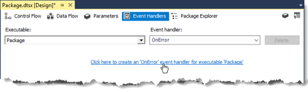
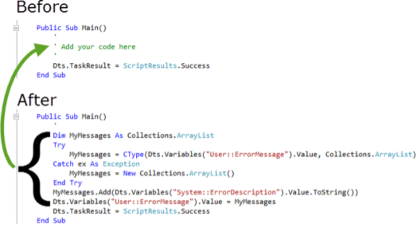
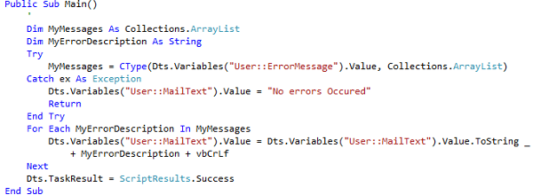

# Lesson 09 Lab Instructions

## Exercise 1: Answer Key

Please note, there are several ways to accomplish the same task in SSIS. The book uses a variety of methods to
 expose
 you to different options. Feel free to use your favorite method throughout the exercises.

In this exercise, you will add a Script Task to an Event Handler to alleviate the problem of sending too many email
 messages when errors occur in your packages. You would like to get messages when errors occur, but not a new message
 for
 every single error. In this script task, you will collect all of the errors and append each error message to the
 previously collected messages. Once all of the messages have been collected, you will use a PostExecute event
 handler to
 send the email message.

Every task in this package is intended to fail and generate an error message.

1. Open **Chapter 09 Reliability\Labs\Starters\SimulateErrors\SimulateErrors.sln** in
 SSDT.
2. Create two package variables. One named **ErrorMessage** of type object and the other named
 **MailText** of type string. No default values need to be set. The **ErrorMessage**
 variable
 will hold an array.
    1. Right-click the Control Flow design surface, and then click `Variables`.
    2. On the icon bar of the Variables window, click the Add Variable
    3. Set the Name to **ErrorMessage** and the Data type to **Object**.
    4. Create a second variable named **MailText** and a Data type of **String**.
3. Add an event handler at the package level that runs when an error occurs.
    1. In the Package Designer, click the **Event Handlers**
    2. On the Event Handlers page, verify that **Package** is selected in the Executables drop-down
     list.
    3. Verify that **OnError** is selected in the Event handler dropdown list.
    4. Click **Click here to create an OnError event handler for executable “Package”** as shown in
     Figure 13.
4. Add a Script Task to the event handler that you created. Configure the Script Task language to VB.Net. The
 Script
 Task will need to be passed the current system error description and the array of error messages. Set up the two
 variables that will be passed to the script. You will need to be able to change the ErrorMessage variable, but not
 the
 system error description variable.
    1. Drag a Script Task from the SSIS Toolbox to the Event Handlers design surface.
    2. Right-click the Script Task, and then click `Edit`.
    3. In the Script Task Editor, change the ScriptLanguage to **Microsoft Visual Basic**.
    4. Click the ellipsis (`…`) next to ReadOnlyVariables, click the box to select
     **System:ErrorDescription**, and then click `OK`.
    5. Click the ellipsis (`…`) next to ReadWriteVariables, click the box next to
     **User::ErrorMessage**,
     and then click `OK`.
5. Edit the script. Use a Try/Catch block to see if your array already exists. If it does, add the current error
 descriptions to the array. If not, initialize the array, and then concatenate any new messages. To cause the error
 messages to be on individual lines, add a hard return after each new message.
 The **code.txt** file located in the **Answers** folder
 includes all the scripts required for the
 labs. You can copy and paste from the appropriate section of this file to save typing.

    1. In the Script Task Editor, click `Edit Script`.
    2. In the VstaProjects scripts editor, Scroll down to the Public Sub Main() section, remove the **‘Add
     your
     code here’** line , and add the code as shown in Figure 14:
     
    3. Verify that the following original code is after the code that you added.
     
        ```
        Dts.TaskResult = ScriptResults.Success End Sub
        ```
    4. Click the `Save All` icon (),
     and then click `Close` (`X`), in the upper right corner.
    5. In the Script Task Editor, click `OK` to close the editor dialog box.
6. Create an event handler that will run after the final task has completed to send out an email message with the
 collected error messages. Remember, task error messages are propagated to the parent, so depending on where and
 how
 you create your script and mail tasks, you may receive multiple emails.
 In addition to using an Event Handler, there are other ways to create a single email message with
 collected error messages included. Feel free to experiment.

    1. In the Executable drop-down list of the Event Handlers designer, expand Executables, select the
     **Execute Divide By 0** executable, and then click `OK`.
    2. Select **OnPostExecute** in the Event handler drop-down list.
    3. Click the **Click here to create an ‘OnPostExecute’ event handler for executable ‘Execute Divide By
     0’**
7. Add a Script Task to write the contents of the error message array variable to the MailText variable, placing a
 hard return between each error message in the array when writing the error messages to the MailText variable.
    1. Drag a script task from the SSIS Toolbox to the Event Handlers design surface.
    2. Right-click the Script task, and then click `Edit`.
    3. In the Script Task Editor, change the ScriptLanguage to **Microsoft Visual Basic**.
    4. Click the ellipsis (`…`) next to ReadOnlyVariables, click the box to select
     **User::ErrorMessage**,
     and then click `OK`.
    5. Click the ellipsis (`…`) next to ReadWriteVariables, click the box next to
     **User::MailText**, and
     then click `OK`.
    6. In the Script Task Editor, click `Edit Script`.
    7. In the VstaProjects scripts editor, scroll down to the Public Main section, and add the code as shown in
     Figure 15:
     
    8. Click the **Save All** icon (), and then click `Close` (**X**), in the
     upper
     right corner.
    9. In the Script Task Editor, click `OK` to close the editor dialog box.
8. Add a task to send an email message to your event handler after the Script Task completes. Set the To Line and
 From Line email addresses to **Admin@adventureworks.com**. Add a subject line of “Package Completed”,
 and
 a message body populated by your MailText variable.
    1. Drag a Send Mail Task from the Common section of the SSIS Toolbox to the Execute Divide By 0 OnPostExecute
     design surface, below the Script Task.
    2. Drag the green precedence constraint arrow from the Script Task to the Send Mail Task.
    3. Right-click the Send Mail Task, and click `Edit`.
    4. In the Send Mail Task Editor, change to the **Mail**
    5. In the SmtpConnection drop-down list, select **New connection**.
    6. In the SMTP Connection Manager Editor, enter **localhost** for the SMTP Server, and then click
     `OK`.
    7. Set both the From and To fields to **Admin@adventureworks.com**.
    8. Set the Subject to **Package Completed**.
    9. Set the MessageSourceType to **Variable**.
    10. Select the **User::MailText** variable in the MessageSource drop-down list, and then click
     `OK`.
9. Test your package.
10. Close your project and solution, but leave SSDT open for the next exercise.

## Exercise 2: Answer Key

The goal of this exercise is to configure the tasks and containers in a package to participate in transactions. You
 will run the package simulating errors at different points in time to see the effects that transactions have on
 package execution when failures occur.

1. Open the **Chapter 09 Reliability\Labs\Starters\Restarting\Restarting.sln** file in
 SSDT.
2. Open the **TestTransaction.dtsx** package.
3. Enable and execute the Create DemoTransactions Table task. Disable the task again after executing it.
4. Review the package checkpoint properties. Notice that these options are not configured. You should avoid mixing
 transactions and checkpoints because the combination is not supported by Microsoft.
    1. On the Control Flow tab, click an empty area of the design surface, and then press `F4` if
     the Properties are not visible.
    2. Verify that **TestCheckpoint Package** is selected in the drop-down list of the Properties
     window.
    3. Review the CheckpointFileName property, CheckpointUsage, and SaveCheckpoints properties.
5. To allow your transactions sufficient time to rollback, configure the **Execute SQL Task
 *X*** tasks so that they do **NOT** fail the package when they fail.
    1. Select the **Execute SQL 1 Task**, hold the `Ctrl` key while you click the remaining
     **Execute SQL Task *X***
    2. If necessary, press `F4` to open the Properties window.
    3. In the Properties window, change the FailPackageOnFailure property to **False**.
6. Modify the package properties so that a transaction is started when the package starts. Additionally, all tasks
 should join the transaction.
    1. On the Control Flow tab, click an empty area of the design surface, and then press `F4` if
     the Properties are not visible.
    2. Verify that **TestTransaction Package** is selected in the drop-down list of the Properties
     window.
    3. In the Transactions section of the Properties window, change the TransactionOption property to
     **Required**.
7. Add the forward slash back into the Execute SQL Task 10 SQL statement to cause a divide by zero error.
    1. On the Control Flow tab, right-click `Execute SQL Task 10`, and then click `Edit`.
    2. Click the ellipsis (`…`) that appears when you click in the SQLStatement property.
    3. Add the Forward Slash (/) between the 1 and 0, as shown in the following code, and then click
     `OK`.
     INSERT INTO dbo.DemoTransactions (Task) VALUES (1/0);
8. Execute the **TestTransactions.dtsx** package, notice that Execute SQL Task 10 failed,
 and then stop debugging.
9. Use SQL Server Management Studio to verify that no rows were added to the DemoTransactions table.
10. Configure the **Execute SQL 2 Task** so that it runs independently and in its own native SQL based
 transaction. It should insert its row even if the package transaction fails.
    1. Configure **Execute SQL Task 2** to not join the parent package’s transaction.
        1. Select Execute SQL Task 2.
        2. In the Transactions section of the Properties window, change the TransactionOption to NotSupported.
    2. Configure **Execute SQL Task 2** to begin a SQL native transaction with the SQL statement, and
     then commit the transaction at the end of the SQL Statement. This over simplification is to show how the
     concept
     functions. In an actual package, you might call a stored procedure from your server that uses a Try/Catch
     block
     and only commits the rows once one or more checks have been run on the data. Otherwise, it rolls the changes
     back.
        1. Right-click `Execute SQL Task 2`, and then click `Edit`.
        2. In the Execute SQL Task Editor, click the ellipsis (`…`) next to the SQLStatement property.
        3. In the Enter SQL Query dialog box, modify the code to include the BEGIN TRANSACTION and COMMIT commands
         as
         shown below, and then click `OK` to close the Enter SQL Query dialog box.
         
        ```
        BEGIN TRANSACTION
        INSERT INTO dbo.DemoTransactions (Task)
            VALUES (N'Execute SQL Task 2')
        COMMIT
        ```
        4. Click `OK` to close the Execute SQL Task Editor.
11. Execute the TestTransaction package, and verify that everything except Execute SQL Task 10 succeeds, and then
 stop debugging.
12. Switch to SSMS and verify that Task 2 has a row in the DemoTransactions table. Close SSMS.
13. In SSDT, save and close your project.