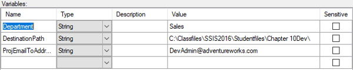
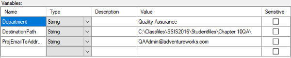
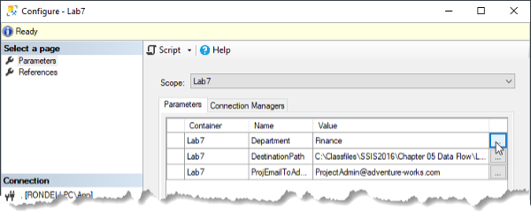
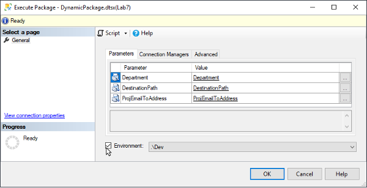
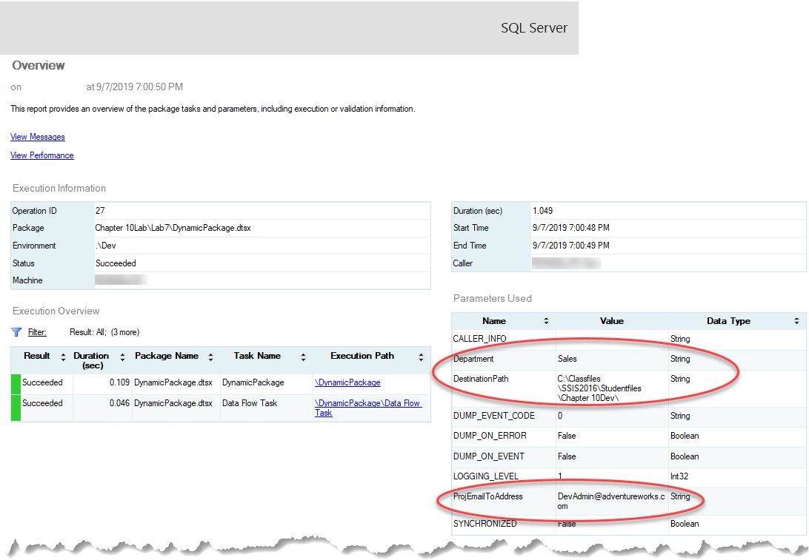

# Lesson 10 Lab Instructions

## Exercise 1: Answer Key

Please note, there are several ways to accomplish the same task in SSIS. The book uses a variety of methods to
 expose
 you to different options. Feel free to use your favorite method throughout the exercises.

The goal of this exercise is to review the process of deploying a project to a new folder on an existing SSIS
 catalog. In this exercise, you will also review the process of configuring environments and attaching an environment
 when executing a package. Answers may vary depending on how the directions are interpreted.

1. Create two new folders in the **Studentfiles** folder, one named **Chapter
 10Dev,** and another named **Chapter 10QA**.
    1. Open Windows Explorer and browse to **Studentfiles** folder.
    2. On the right side on Windows Explorer, right-click a blank area, and then click <code class="nocopy">New</code> >
     **Folder**. Replace the name of **New folder** with **Chapter 10Dev**.
    3. Repeat this process to create a second folder off the root of the C drive named **Chapter
     10QA**.
     
    This folder structure will simulate an environment where your files will exist in different locations on
     the
     different servers in the real world.
2. If one does not already exist on your SQL Server instance, create the SSIS Catalog.
    1. From the Start menu, open **SQL Server Management Studio**.
    2. In the Connect to Server dialog box, verify that the Server type is set to **Database Engine**,
     your
     server name is entered, and the proper authentication is set, and then click <code class="nocopy">Connect</code>.
    3. In Object Explorer, right-click the **Integration Services Catalogs** folder, and then click
     <code class="nocopy">Create Catalog</code>.
    4. In the Create Catalog dialog box, click <code class="nocopy">Enable CLR Integration</code>.
    5. Click <code class="nocopy">Enable automatic execution of Integration Services stored procedure at SQL Serve startup</code>.
    6. Type **Pa$$w0rd** in the Password and Retype Password dialog boxes, and then click
     <code class="nocopy">OK</code>.
3. In SQL Server Management Studio, create a new folder named **Chapter 10Lab** in the SSIS
 Catalog.
    1. If you just created the SSIS Catalog and SQL Server Management Studio is already open, skip to step (3).
     From the
     Start menu, open **SQL Server Management Studio**.
    2. In the Connect to Server dialog box, verify that the Server type is set to **Database Engine**,
     your
     server name is entered, and the proper authentication is set, and then click <code class="nocopy">Connect</code>.
    3. In Object Explorer, expand **Integration Services Catalogs**, right-click the **SSISDB
     catalog**, and then click <code class="nocopy">Create Folder</code>.
    4. In the Create Folder dialog box, type **Chapter 10Lab** in the Folder name box, and then click
     <code class="nocopy">OK</code>.
    5. Expand the SSISDB catalog and verify the creation of your new folder.
    6. Leave Management Studio open for later in the exercise.
4. Open the Visual Studio solution file located at **Chapter 10
 Deploying\Labs\Starters\Lab7\_Answer\Lab7.sln**.
    1. Open **SQL Server Data Tools**.
    2. In Visual Studio, click <code class="nocopy">File > Open > Project/Solution</code>.
    3. Browse to **Chapter 10 Deploying\Labs\Starters\Lab7\_Answer\** and click
     **Lab7.sln**, and then click <code class="nocopy">Open</code>.
5. Deploy the project to the Chapter 10Lab folder on your SSIS Catalog.
    1. In Solution Explorer, right-click the **Lab7** project, and then click <code class="nocopy">Deploy</code>.
    2. The Integration Services Deployment Wizard launches. If the Introduction page appears, select the **Do
     not
     show this page again** option, and then click <code class="nocopy">Next</code>.
     
    You may get a warning message: Failed to decrypt an encrypted XML node. By default, SSDT encrypts
     sensitive data
     based on the user key. If the package is deployed by a different users than it was created by, sensitive
     data is
     removed. There is no sensitive data in this case. If there were, the data would have to be replaced after
     deployment.
    3. On the Select Destination page, type in your server name, or click <code class="nocopy">Browse</code>, click your server,
     and
     then click <code class="nocopy">OK</code>. Click Connect. In the path box, click <code class="nocopy">Browse</code>, click the
     **Chapter
     10Lab** folder, and then click <code class="nocopy">OK</code>. Notice that the path includes the project name after
     the folder
     that you selected.
    4. Click <code class="nocopy">Next</code>.
    5. Review your selections, and then click <code class="nocopy">Deploy</code>.
    6. Once the deployment has succeeded, click <code class="nocopy">Close</code>, and then return to SQL Server Management
     Studio.
6. Verify that the project was successfully deployed.
    1. In Object Explorer, expand <code class="nocopy">SSISDB > Chapter 10Lab > Projects</code>, verify that the Lab5
     Project
     and **DynamicPackage.dtsx** in the Packages folder were successfully
     deployed.
7. In SQL Server Management Studio, create two environments in the Chapter 10Lab folder. Name them
 **Dev** and **QA**.
    1. In the **Chapter 10Lab** folder, right-click the **Environments** folder, and then
     click <code class="nocopy">Create Environment</code>.
    2. In the **Environment name** box, type **Dev**, and then click <code class="nocopy">OK</code>.
    3. Repeat the process to create an environment named **QA**.
8. In both the Dev and QA environments, create three variables that will map to the
 **DestinationPath**,
 **Department**, and **ProjEmailToAddress** Project parameters.
9. In the **Dev** Environment set the **DestinationPath** to
 **C:\Classfiles\SSIS2016\Studentfiles\Chapter 10Dev\**, set the
 **Department** to
 **Sales**, and the **ProjEmailToAddress** to
 **DevAdmin@adventure-works.com**.
    1. Under the Environments folder in Object Explorer, right-click <code class="nocopy">Dev</code>, and then click
     <code class="nocopy">Properties</code>.
    2. In the Environment Properties dialog box, click <code class="nocopy">Variables</code> in the Select a page section.
    3. Create three new variables as shown in Figure 16, and then click <code class="nocopy">OK</code>.
     
10. In the **QA** Environment set the **DestinationPath** to
 **C:\Classfiles\SSIS2016\Studentfiles\Chapter 10QA\**, set the
 **Department** to
 **Quality Assurance**, and the **ProjEmailToAddress** to
 **QAAdmin@adventure-works.com**.
    1. Under the Environments folder in Object Explorer, right-click <code class="nocopy">QA</code>, and then click
     <code class="nocopy">Properties</code>.
    2. In the Environment Properties dialog box, click <code class="nocopy">Variables</code> in the Select a page section.
    3. Create three new variables as shown in Figure 17, and then click <code class="nocopy">OK</code>.
     
11. Configure the Lab7 project to reference the Dev and QA environments.
    1. In Object Explorer, expand **Integration Services Catalogs > SSISDB > Chapter 10Lab >
     Projects** and right-click the **Lab7** project, and then click <code class="nocopy">Configure</code>.
    2. In the Configure – Lab7 dialog box, click <code class="nocopy">References</code> in the Select a page area.
    3. On the References page, click <code class="nocopy">Add</code>, click <code class="nocopy">Dev</code>, and then click <code class="nocopy">OK</code>.
    4. Repeat this process to reference the **QA** environment.
    5. Do **not** close the Configure – Lab7 dialog box.
12. Map the variables that you created in Step 8 to the project parameters in the **Lab5** project.
    1. In the Configure – Lab7 dialog box, click <code class="nocopy">Parameters</code> in the Select a page area, and then select
     **Lab7** in the Scope drop-down list.
    2. On the Parameters tab, click the ellipsis (<code class="nocopy">…</code>) at the end of the Department row as shown in
     Figure 18:
     
    3. In the Set Parameter Value dialog box, click the radio button for **Use environment variable**,
     select **Department** from the drop-down list, and then click <code class="nocopy">OK</code>.
    4. Repeat this process to map the DestinationPath and ProjEmailToAddress varibles.
    5. Click <code class="nocopy">OK</code> to close the Configure – Lab7 dialog box.
13. Execute the **DynamicPackage.dtsx** package, associate the execution with one of the
 environments.
 Verify that the email is addressed to the appropriate admin, and that the Excel file is in the proper location and
 for
 the proper department.
    1. In Object Explorer, expand the Packages folder under the Lab7 project.
    2. Right-click the **DynamicPackage.dtsx** package, and then click
     <code class="nocopy">Execute</code>.
    3. In the Execute Package dialog box, click the box next to **Environment** near the bottom of the
     dialog box as shown in Figure 19, select the **.\Dev** environment, and then click
     <code class="nocopy">OK</code>.
     
    4. Click <code class="nocopy">Yes</code> in the SSMS message that prompts you to open the Overview Report now. Review the
        report to verify the environment settings were used during the package execution. You can review the parameter settings in the
        Parameters Used section of the report as shown in Figure 20.

        If you did not perform the lab associated with
        Chapter 7, your package may fail if the prerequisite objects do not exist in your database.

        
    5. Open Windows Explorer and Browse to the **C:\Chapter 10Dev** folder to verify that a **SalesDepartmentHistory.csv** file exists.
    6. Go to your mail program or the mail drop folder to verify that there is an email message addressed to
     DevAdmin@adventure-works.com. If you are using the Windows built-in SMTP service, you should find the message at **C:\inetpub\mailroot\Drop**.
    7. If time permits, repeat your test with the QA environment.
14. Clean up your work environment by closing any projects, queries, or Windows Explorer windows that you opened
 during this lab.

## Exercise 2: Answer Key

Some organizations have standardized on processes other than the SQL Server Agent to automate database jobs. For
 these cases, and when you need to test a package outside of SSDT or SSMS, it is important to know how to use command
 line utilities to execute your packages. In this exercise, use dtexec to run the **DynamicPackage.dtsx**
 package located in the SSIS catalog.

Please note, there are several ways to accomplish the same task in SSIS. The book uses a variety of methods to
 expose
 you to different options. Feel free to use your favorite method throughout the exercises.

1. Open a command prompt window.
    1. Type cmd into Windows Start > Search box.
2. Use the /? option to view the available help for dtexec.
    1. In the *Username*: Command Prompt window, type <code class="nocopy">dtexec /?</code> and then press
     <code class="nocopy">Enter</code>.
    2. Use the scroll bar and review the options.
    3. Leave the Command Prompt window open for later in this exercise.
3. Use Notepad to create a batch file named **mydtexec.bat** that will use dtexec to run
 the
 **DynamicPackage.dtsx** package from the SSIS catalog on your server. The package should
 use the
 variables defined in the **Dev** environment. Creating the batch file will make it easier for you to
 troubleshoot and make modifications to your code, along with giving you the ability to reuse it.
 You will need to specify the location of the package, the server where the package is located,
 and the environment id.

    1. Open **Notepad**.
    2. In Notepad, click **File > Save**.
    3. In the Save As dialog box, browse to your **C:\Classfiles\SSIS2016\Studentfiles**
     folder, and then type **mydtexec.bat** in the **File name** field. Click the
     <code class="nocopy">Save</code> button.
     Leave Notepad open.
    4. Open SQL Server Management Studio (SSMS) and connect to the Database Engine.
    5. Locate the environment ID for the Dev environment by expanding **Integration Services Catalogs >
     SSISDB
     > Chapter 10Lab > Environments**, right-clicking <code class="nocopy">Dev</code>, and selecting
     **Properties**.
    6. The environment ID is located on the General page and named Identifier.
    7. Type the following command, into mydtexec.bat, **on a single line** to execute the
     **DynamicPackage.dtsx** package and associate it with the Dev environment.
     
    Do **NOT** add any hard returns to the text. They are included here due to spacing
     limitations.
     If your path is different, change the path string following /IS. Also, change the 1 following /Env to be
     the
     identifier for your Dev environment.
    
    
    
    
    ```
    dtexec /SERVER "." /IS "\SSISDB\Chapter 10Lab\Lab7\DynamicPackage.dtsx" /Env 1
    ```
    8. Save your batch file.
4. Execute your batch file, and then verify the results using the messages in the command prompt window as well as
 the SSIS execution reports in SSMS.
    1. In the Command Prompt window, change to the Classfiles folder and type <code class="nocopy">CD Studentfiles</code> and then
     press <code class="nocopy">Enter</code>.
    2. At the **C:\Classfiles** prompt, type **mydtexec**, and then press
     <code class="nocopy">Enter</code>.
    3. When the **C:\Classfiles** prompt returns, review the messages to verify that your
     package ran. There should be an
     Execution ID. Make note of the Execution ID.
     
    If you need to troubleshoot your batch file, return to Notepad and edit the file. Be sure to save
     your changes before trying to execute the batch file again.
    4. Return to SSMS.
    5. In Object Explorer, go to Integration Services Catalogs > SSISDB > Chapter 10Lab.
    6. Right-click <code class="nocopy">Chapter 10Lab</code>, and then click <code class="nocopy">Reports > Standard Reports > All Executions</code>.
    7. Use the ID column to determine the row you are looking for.
    8. Click the Overview link in the row with the most recent time to see the general execution report including
     the
     list of parameters used. In the Parameters section, verify that the variables defined in the Dev environment
     were used
     as shown in Figure 21.
     