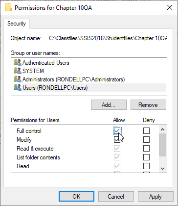
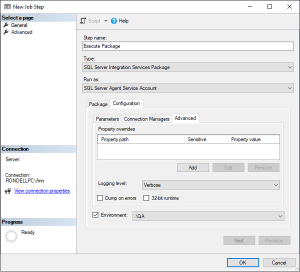

# Lesson 11 Lab Instructions

## Exercise 1: Answer Key

Please note, there are several ways to accomplish the same task in SSIS. The book uses a variety of methods to
 expose
 you to different options. Feel free to use your favorite method throughout the exercises.

The goal of this exercise is to review the process of using jobs to automate package executions. In this exercise,
 you will create a job to run the **DynamicPackage.dtsx** and schedule that job to run on
 two different
 schedules.

1. Change the NTFS permissions on the Chapter 10QA and Chapter 10Dev folders so that the Users (or Domain Users)
 group has Full Control of each folder.
    1. Open File Explorer.
    2. Browse to the **Studentfiles\Chapter 10QA** folder.
    3. Right-click the **Studentfiles\Chapter 10QA** folder, and then click
     `Properties`.
    4. In the Chapter 10QA Properties window, click the **Security**
    5. On the Security tab, click `Edit`.
    6. In the Permissions for Chapter 10QA folder dialog, highlight the Users or Domain Users group, and then click
     `Allow` next to Full control as shown in Figure 19.
     
    7. Click `OK` twice to close the dialog boxes.
    8. Repeat steps (3)-(7) for the **Chapter 10Dev** folder.
    9. Close Windows Explorer.
2. Create a new job named **WeeklyPackage**.
    1. If necessary, open SQL Server Management Studio (SSMS) and connect to the Database Engine.
    2. In Object Explorer, verify that the SQL Server Agent service is started, a green triangle should be visible,
     rather than a red down arrow on the server icon as shown . If not, right-click the **SQL Server
     Agent**, and then click `Start`.
    3. In Object Explorer, expand **SQL Server Agent**, right-click the **Jobs** folder,
     and then click `New Job`.
    4. In the New Job dialog box, type **WeeklyPackage** in the Name field.
3. Configure the first step of the WeeklyPackage job to execute the **DynamicPackage.dtsx** package deployed in
 Chapter 9.
    1. In the Select a page area of the New Job dialog box, click `Steps`.
    2. Near the bottom of the dialog box, click `New` to add a new job step.
    3. Type **Execute Package** in the Step name field.
    4. Select SQL Server Integration Services Package in the Type drop-down list.
    5. On the Package tab, verify that SSIS Catalog is selected in the Package source drop-down list.
    6. Type **(local)** in the Server field.
    7. Click the Ellipsis **(…)** to the right of the Package field, expand each folder until you can
     select the **DynamicPackage.dtsx** package, and then click `OK` to return
     to the New Job Step dialog
     box.
4. Configure the package to use the QA environment and to use verbose logging.
    1. In the New Job Step dialog box, change to the Configuration tab as shown in Figure 20.
    2. Click the checkbox next to Environment.
    3. Select .\QA from the Environment drop-down list. Notice that all of the red exclamation point circles are
     now
     gone.
    4. On the Configuration tab, change to the Advanced sub-tab.
    5. In the Logging level drop-down list, select **Verbose**.
5. Configure the package to include the job step details in the job history.
    1. In the Select a page area on the left of the New Job Step, click `Advanced`.
    2. Select the check box next to **Include step output in history**, and then click `OK`
     to close the New Job Step dialog box.
6. Schedule the package to run at 6pm on weekdays and at noon on weekends.
    1. In the Select a page area of the New Job dialog box, select **Schedules**.
    2. At the bottom of the Schedule list, click `New`.
    3. In the Name field, enter Weekdays.
    4. In the Frequency section, remove the check from Sunday, and select Monday, Tuesday, Wednesday, Thursday, and
     Friday.
    5. In the Daily Frequency section, set the Occurs once at field to **6:00:00 pm**.
    6. Review the other settings, and then click `OK` to close the New Job Schedule dialog box.
    7. Repeat this process to create a second schedule named Weekends that runs on Saturday and Sunday at noon.
    8. After the second schedule is defined, click `OK` to close the New Job dialog box.
7. Test the job by running it manually.
    1. In Object Explorer, expand **SQL Serve Agent > Jobs**, right-click the
     **WeeklyPackage** job, and then click **Start job at step.**
    2. Wait for the job to finish running, and then click `Close`.
8. Review the job history.
    1. In Object Explorer, under **SQL Server Agent > Jobs**, right-click the
     **WeeklyPackage** job, and then click `View History`.
    2. In the Log File Viewer, click the plus (+) sign next to the most recent execution time of your job.
    3. Highlight each of the rows in the summary and view the log information in the gray box at the bottom of the
     screen.
     
    The information at the top of each step is nearly identical. Scroll down or enlarge the box to see
     the detailed information that changes for each row.
    4. Click `Close` to close the Log File Viewer.
9. Review the report history.
    1. In Object Explorer, go to **Integration Services Catalogs > SSISDB > Chapter 10Lab**.
    2. Right-click Chapter 10Lab, and then click **Reports > Standard Reports > All
     Executions**.
    3. Use the Start Time column to determine the row for the most recent execution of your package. Review the
     Status and Duration of this execution.
    4. Click the Overview link in the row with the most recent time to see the general execution report including
     the
     list of parameters used. Verify that the parameters for the QA environment were used.
    5. In the toolbar just under the tab titled overview, click the **Navigate Backward**  icon at the
     top of the window to return to the All Executions report.
    6. On the All Executions report, click the **All Messages** link in the row with the most recent
     execution.
    7. Review detailed messages provided on the Messages report.
    8. Near the top of the report, click the **View Overview** link to change to the Overview
     report.
    9. On the Overview report, click `View Performance`, and then review the information provided on the
     Execution Performance report. Notice that this report not only reports data on the specific execution you were
     looking at, but also historical information for other executions of the same package.
    10. Close the report tab.
10. If time permits, change the Configuration > Advanced Logging level property of the first job step to
 Performance, run the job again, and then view the differences of the detail level on the Messages report.