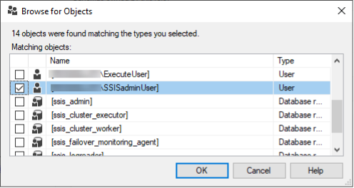
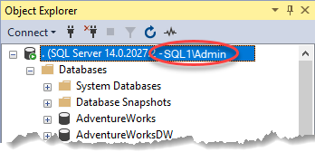
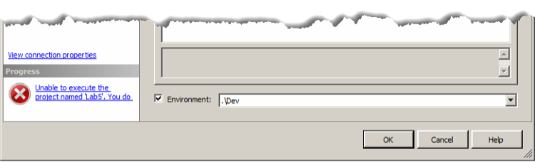

# Lesson 12 Lab Instructions

## Exercise 1: Answer Key

Please note, there are several ways to accomplish the same task in SSIS. The book uses a variety of methods to
 expose
 you to different options. Feel free to use your favorite method throughout the exercises.

In this exercise, you will test certain administrative functions such as deploying and executing packages to
 reinforce the concepts of what permissions are required to perform certain tasks.

The classroom setup should have created three Windows users named SSISadminUser, DeploymentUser, and ExecuteUser.
 If the users have not been created, use the Run as Administrator option to execute the batch file at
 **SSIS2016\Setup\AddUser.bat**. Verify that the three create user commands completed
 successfully, then press the “Any
 Key”.
 

Additionally, if you do not want to log out and back in to test the security settings, and the right-click Run as
 different user option is not available on your Start menu, and have Windows 10 or Pro, you can perform the tasks
 described int [HOW TO RUN A PROGRAM AS ANOTHER USER IN WINDOWS 10?](https://www.ilovefreesoftware.com/15/windows-10/run-program-another-user-windows-10.html)
 to enable this functionality. If you have Windows 10 Home edition, or
 don’t want to make the changes, you can log out and back in to test the security settings configured in the lab.
 

1. Create SQL Server Logins for the SSISadminUser, DeploymentUser, and ExecuteUser accounts.
    1. Create the SSISadminUser Login based on Windows authentication of a Windows account with the same name.
        1. Open SQL Server Management Studio.
        2. In Object Explorer, expand **Security**.
        3. In Object Explorer, right-click `Logins`, and then click `New Login`.
        4. In the Login - New dialog box, on the General page, click `Search`.
        5. Verify that the **Select this object type** field is set to User or Built-in security
         principal.
        6. Verify that your computer name is showing in the **From this location**  If it is not,
         click
         the `Locations` button and select your computer name from the list.
        7. Click Advanced to allow you to browse for the Windows user account, and then click `Find
         Now`.
        8. In the Search results, highlight **SSISadminUser**, and then click `OK` to close
         the Advanced portion of the dialog box.
        9. Click `OK` again to close the Select User or Group dialog box. Leave the Login – New dialog
         box
         open.
    2. Set the default database to **SSISDB**.
        1. On the General page, select **SSISDB** in the Default database in the drop-down list.
    3. Add the login id to the SSISDB database as a user with the same name.
        1. In the Select a page area, click `User Mapping` to change pages.
        2. On the User Mapping page, click the check box in the Map column next to the SSISDB database, and then
         click `OK` to close the Login – New dialog box.
    4. Repeat this process for the DeploymentUser and ExecuteUser accounts.
2. Add the SSISadminUser to the SSIS\_Admin role.
    1. In Object Explorer, expand `Databases > SSISDB > Security > Roles > Database Roles`.
    2. Right-click the **ssis\_admin** role, and then click `Properties`.
    3. In the Database Role Properties dialog box, on the General page, click `Add` at the bottom of the
     page.
    4. In the Select Database User or Role dialog box, click `Browse`.
    5. Click the check box next to the **[YourServerName\SSISadminUser]** account, as shown in Figure
     6,
     and then click `OK` to close the Browse for Objects dialog box.
     
    6. Click `OK two` more times to close the Select Database User or Role and Properties dialog boxes.
    7. Notice that the instance title in Object Explorer has your current administrator user name in parentheses as
     shown
     in Figure 7.
     
    8. Minimize this copy of SSMS.
3. Launch a new copy of SSMS using the right-click Run as different user option and launch the application as
 SSISAdminUser.
    1. Type **SSMS** in the Start menu to locate SQL Server Management studio, and then right-click
     >
     **Run as different user**.
    2. In the Windows Security dialog box, type **SSISadminUser** in the User name text box, and
     **Pa$$w0rd** in the Password text box, and then click `OK`.
     
    The password has a zero (0) and not the letter O. Also, in a domain environment, add the workstation or
     domain name
     where the account was created before the name, then a backslash, as in SQL1\SSISadminUser.
    3. When the Connect to Server dialog box appears, verify **Database Engine**, **your server
     name**, and **Windows Authentication** are selected, and then click
     `Connect`. Notice
     the username next to the instance name shows SSISadminUser.
4. Run the **DynamicPackage.dtsx** package that you deployed in Chapter 10.
    1. In Object Explorer, click to expand **Integration Services Catalog > SSISDB > Chapter 10Lab >
     Projects > Lab7 > Packages**.
    2. Right-click **DynamicPackage.dtsx**, and then click `Execute`.
    3. Click the check box next to Environment to associate the **.\Dev** environment with this
     execution, and then click `OK` to execute the package.
    4. In the pop-up Microsoft SQL Server Management Studio message that informs you that the operation has
     started,
     click `No` to avoid opening the Overview report.
5. View the execution report for all executions. Notice that this user can see all executions, not just their own.
 The package execution probably failed. Review the messages to determine the cause of the error. You will not be
 fixing
 this particular error at this time, but an explanation exists in the **Solution** section detailed
 step 5. (2).
    1. Right-click the Chapter 10Lab folder, and then click Reports > Standard Reports > All Executions.
     Notice that all previous executions are visible to anyone who is a member of the ssis\_admin role.
    2. Click the **All Messages** link for the most recent execution, and review the error messages.
     All of the connection managers in this package use integrated authentication. The SSISadminUser does not have
     permissions to the AdventureWorks database. In fact, since the user account doesn’t exist in that database and
     the
     guest account is disabled, SSIS cannot even connect to the database to validate the table names, etc.
6. Close the SSISadminUser copy of SSMS and return to the copy of SSMS where you are logged on as
 administrator.
7. Modify the permissions on the Chapter 10Lab folder to include the DeploymentUser and ExecuteUser accounts.
 DeploymentUser should be able to deploy projects, but not execute the packages in the projects they deploy or in
 other
 projects. The ExecuteUser account should be able to execute packages, but not create environments, modify
 permissions,
 or deploy new projects.
    1. In Object Explorer, under **Integration Services Catalogs > SSISDB**, right-click the
     **Chapter 10Lab** folder, and then click `Properties`.
    2. In the Select a page area of the Folder Properties dialog box, click `Permissions`.
    3. Next to Logins or roles, click the **Browse**
    4. In the Browse All Principals dialog box, click the boxes to select the
     **YourServerName\DeployementUser** and **YourServerName\ExecuteUser** login names,
     and
     then click `OK`.
    5. Highlight the DeploymentUser in the Logins or roles area, and then click the boxes in the Grant column for
     the
     **Read**, **Create Objects**, and **Read Objects** permissions.
    
     
    The Create Objects permission alone will not provide sufficient permissions. The Read permission is
     required to see
     the folder so that you can specify the path to deploy to, and the Read Objects must be included to see if
     there is
     already a project with that name to be updated rather than deployed fresh.
    6. Highlight the ExecuteUser in the Logins or roles area, and then click the boxes in the Grant column for the
     **Read**, **Read Objects**, and **Execute Objects**
    7. Click `OK` to close the Folder Properties dialog box.
8. The DeploymentUser should be able to redeploy the Lab7 project, but should NOT be able to modify environments or
 other projects already deployed in the Chapter 10Lab folder.
    1. In Object Explorer, under **Integration Services Catalogs > SSISDB > Chapter 10Lab >
     Projects** folder, right-click `Lab7`, and then click `Properties`.
    2. In the Select a page area of the Folder Properties dialog box, click `Permissions`.
    3. Next to Logins or roles, click the **Browse**
    4. In the Browse All Principals dialog box, click the boxes to select the
     **YourServerName\DeployementUser** login name, and then click `OK`.
    5. Highlight the DeploymentUser in the Logins or roles area, and then click the boxes in the Grant column for
     the
     **Modify** permission, and then click `OK`.
9. Test the permissions you assigned.
    1. DeploymentUser should be able to deploy projects, but not execute the packages in the projects they deploy
     or
     in other projects already deployed to the server. Additionally, they should not be able to modify any of the
     existing environments.
        1. Type **SSDT** in the Start menu to locate SQL Server Management studio, and then
         `right-click > Run as different user`.
        2. In the Windows Security dialog box, type **DeploymentUser** in the User name text box, and
         **Pa$$w0rd** in the Password text box, and then click `OK`.
        3. Open the **Lab7.sln** file from the Chapter 10\Labs\Starters\Lab7\_Answer
         folder.
        4. In Solution Explorer, right-click the Lab7 project, and then click `Deploy`.
        5. On the Introduction page of the Integration Services Deployment Wizard, click `Next`.
        6. If a validation pop-up window appears with a warning about a failed decryption, click `OK` to
         dismiss the
         error message. It has no bearing on this lab.
        7. On the Select Destination page, verify that a period (.) or your server name appears in the Server name
         field, and that /SSISDB/Chapter 10Lab/Lab7 is entered in the Path field, and then click
         `Next`.
         
        If you completed the previous labs, a warning should show at the bottom of the page explaining that a
         project with
         this name already exists and the new version will replace the old version.
        8. On the Review page, verify that the Summary information is correct, and then click `Deploy`.
        9. Verify that the deployment worked. If the deployment failed, click the Failed links, and then verify the
         permissions associated with the message.
        10. Launch a copy of SSMS as the Deployment user, and connect to the Database Engine.
        11. In Object Explorer, under **Integration Services Catalogs > SSISDB > Chapter 10Lab
         > Environments**, right-click `Dev` and select
        12. **Under Select a page, click Variables.** You should be able to type information into the
         fields, but
         when you click `OK`, you should receive an Operation failed message due to the insufficient
         permissions.
        13. Click `Cancel` to close the Environment Properties dialog box.
        14. Right-click the **Environments** folder and select **Create Environment**.
         Enter
         **Test** for the environment name, and then click `OK`. The Test environment
         should appear in
         the Environments folder.
         
        Since you have the Create permission at the parent folder, you will be able to add new Environments
         and modify the
         ones that you own, but you cannot modify any existing environments.
        15. In Object Explorer, under **Integration Services Catalogs > SSISDB > Chapter 10Lab
         > Projects > Lab7 > Packages**, right-click **DynamicPackage.dtsx**, and then click
         `Execute`.
        16. Use the Environment check box to associate the Dev environment with the execution, and then click
         `OK`.
         You should receive a message similar to Figure 8.
         
        17. Click Cancel to close the Execute Package dialog box.
        18. Close the DeploymentUser copy of SSMS.
    2. The ExecuteUser account should be able to execute packages, but not create environments, modify permissions,
     or
     deploy new projects.
        1. Use the `Shift-right-click > Run as different user` option to launch SSMS as
         **ExecuteUser** and connect to the Database Engine.
        2. In Object Explorer, under **Integration Services Catalogs > SSISDB > Chapter 10Lab >
         Projects > Lab7 > Packages**, right-click **DynamicPackage.dtsx**, and then
         click `Execute`.
        3. In the Execute Package dialog box, click the Environment check box and associate the
         **.\Dev**
         environment with the execution, and then click `OK`.
        4. In the Pop-up dialog box, click `Yes` to view the Overview Report.
        5. Because ExecuteUser has not been given the proper database permissions, the package fails, but the
         package was
         executed. To successfully execute the package, ExecuteUser would need all appropriate database and file
         system
         permissions for any package that they need to execute manually.
    3. As ExecuteUser, review the **All Executions** report from the Chapter 10Lab folder. Notice that
     ExecuteUser can only see executions associated with his account.
        1. In Object Explorer, under **Integration Services Catalogs > SSISDB**, right-click
         **Chapter 10Lab > Reports > Standard Reports > All Executions**.
        2. Review the execution(s) listed. ExecuteUser should only see executions performed by their account during
         this
         lab.
10. If time permits, create a different folder under SSISDB, and test to see if the DeploymentUser account can
 deploy
 a project to that folder.